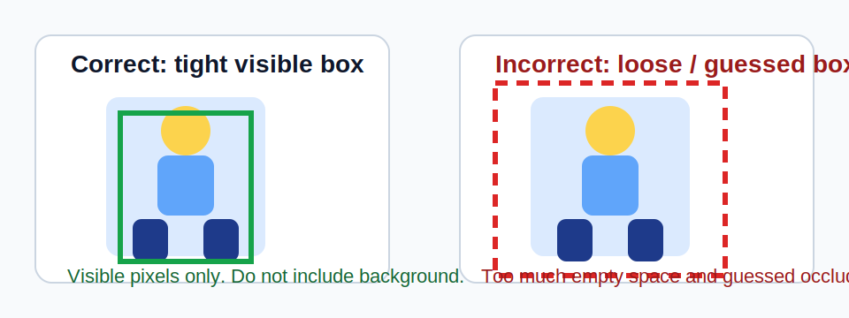
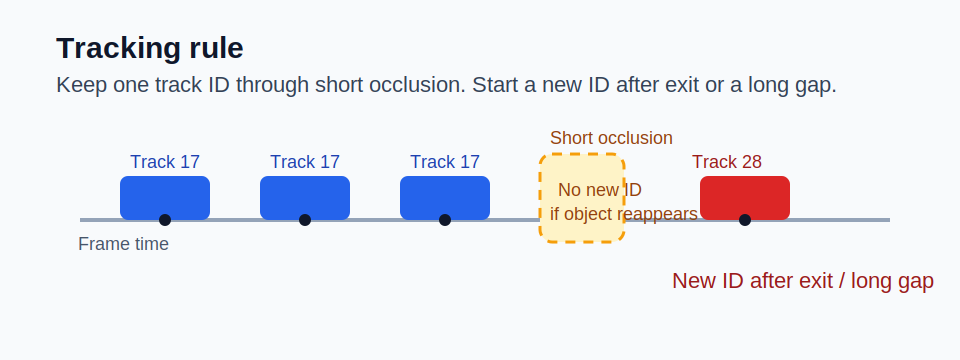
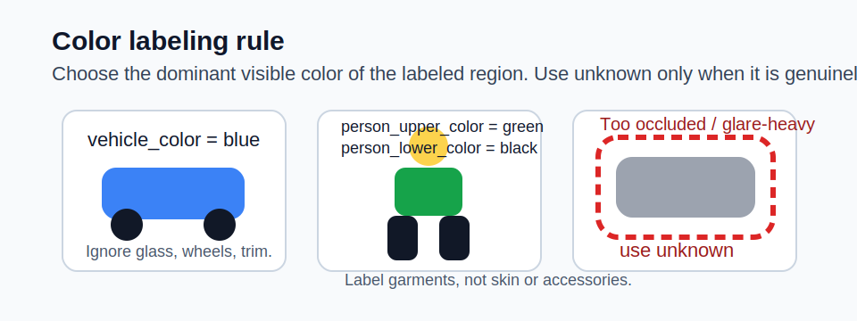

# Annotation Guidelines

This guide defines the baseline labeling policy for CVAT. It is the operator
reference for the three pilot projects created by
`scripts/annotation/setup_cvat_projects.py` and it must stay aligned with:

- `docs/taxonomy.md`
- `services/db/models.py`
- `docs/bake-off-protocol.md`

## 1. Project Mapping

| CVAT Project | Purpose | Annotation Mode | Primary Export |
|--------------|---------|-----------------|----------------|
| `detection-eval` | Detector bake-off frames | annotation mode | `COCO 1.0` or `Datumaro` |
| `tracking-eval` | Tracker bake-off clips | interpolation / track mode | `MOT 1.1` |
| `attribute-eval` | Color attribute crops or frames | annotation mode | `CVAT for images 1.1` or `Datumaro` |

The three projects feed the three bake-off tracks from
`docs/bake-off-protocol.md`:

- `detection-eval` feeds the detector comparison
- `tracking-eval` feeds the ByteTrack vs BoT-SORT comparison
- `attribute-eval` feeds the color-classifier comparison

## 2. Canonical Labels

### 2.1 Object Classes

Use these class names exactly. Do not invent synonyms, plurals, or aliases.

| Class | Use For | Do Not Use For |
|-------|---------|----------------|
| `person` | Humans in any posture | mannequins, posters, statues |
| `car` | passenger cars, SUVs, hatchbacks | pickups, vans used as cargo trucks, buses |
| `truck` | pickups, cargo trucks, box trucks, semi-trailers | passenger cars, buses |
| `bus` | buses, minibuses, coaches | vans with <= 8 passenger seats |
| `bicycle` | pedal bikes, e-bikes, cargo bikes | scooters, mopeds, motorcycles |
| `motorcycle` | motorcycles, scooters, mopeds | bicycles |
| `animal` | visible non-human animals | humans, statues, pets on posters |

### 2.2 Color Attributes

Use the exact enum values from `docs/taxonomy.md` and
`services/db/models.py`:

```text
red | blue | white | black | silver | green | yellow | brown | orange | unknown
```

Apply attributes only where the taxonomy allows them:

| Attribute | Allowed Classes |
|-----------|-----------------|
| `vehicle_color` | `car`, `truck`, `bus`, `motorcycle` |
| `person_upper_color` | `person` |
| `person_lower_color` | `person` |

No color attributes are assigned to `bicycle` or `animal`.

## 3. Bounding Box Rules

### 3.1 Core Rules

1. Draw one rectangle per physical object.
2. The box must be tight to the visible pixels of the object.
3. Do not include background padding just to make the box easier to click.
4. Do not hallucinate hidden bodywork, limbs, or cargo behind occlusion.
5. If the object touches the image boundary, clip the box at the boundary.
6. Annotate partially occluded objects only when the object class remains
   identifiable and at least roughly one-third of the object is visible.
7. If the visible fragment is too small or ambiguous to classify reliably, do
   not label it.



### 3.2 Class-Specific Notes

- `person`: include head, torso, arms, and legs that are visible; exclude
  reflections and shadows.
- `car` / `truck` / `bus` / `motorcycle` / `bicycle`: box the full visible
  vehicle body including wheels or handlebars when visible.
- `animal`: box the visible animal silhouette; do not annotate cages, leashes,
  or shadows.

### 3.3 Common Failure Modes

- Loose boxes that include large floor, road, or sky regions.
- Two nearby objects covered by a single group box.
- Boxes centered on the object but missing bumpers, feet, or tail sections.
- Reclassifying the same object as `car` in one frame and `truck` in another
  without a real viewpoint reason.

## 4. Track Mode Rules

Use these rules only in `tracking-eval`.

### 4.1 Track Continuity

1. Use interpolation mode for moving objects.
2. One physical object gets one track ID for its continuous presence in the
   clip.
3. Keep the same track through short occlusion or brief overlap if the object
   clearly reappears as the same instance.
4. Start a new track ID after the object fully exits the scene or after a long
   ambiguity gap where identity cannot be defended.
5. Never recycle an old track ID for a different object.



### 4.2 Keyframe Placement

Add a new keyframe whenever:

- the object first appears
- the object leaves the frame
- the box size changes materially
- the object rotates enough that the tight rectangle changes
- occlusion starts or ends
- the object stops being labelable, becomes ignored, or re-enters clearly

### 4.3 MOT Export Notes

`tracking-eval` is intended for `MOT 1.1` export, so every tracked label uses
two MOT-friendly attributes:

- `visibility`: numeric value from `0.00` to `1.00`
- `ignored`: checkbox for objects that stay in context but should not count as
  clean tracking evidence

Operational rule:

- set `visibility` to the approximate visible fraction of the object
- set `ignored=true` only for severe truncation, extreme blur, or target
  ambiguity that makes the track unusable for clean benchmarking

## 5. Color Attribute Rules

### 5.1 General Rules

1. Label the dominant visible color of the allowed region only.
2. Use the shared enum values exactly.
3. `unknown` is valid only when the color is genuinely unresolved because of
   darkness, blur, glare, occlusion, camouflage, or mixed colors with no clear
   dominant answer.
4. Do not leave an applicable color blank. Blank means “not annotated”, not
   “unknown”.

### 5.2 Vehicles

- Label painted body panels, not windows, tires, license plates, or roof racks.
- Prefer `silver` for metallic gray vehicle bodies.
- Use `white` for clearly white paint even if the image is cool or overexposed.
- When two colors are close, choose the color covering the most visible body
  area.

### 5.3 Persons

- `person_upper_color`: shirt, jacket, hoodie, coat, or other dominant upper
  garment.
- `person_lower_color`: trousers, shorts, skirt, or other dominant lower
  garment.
- Ignore hats, shoes, bags, and skin tone when deciding garment color.
- If a long coat fully hides the lower garment, set `person_lower_color` to
  `unknown`.



## 6. Quality Bar

### 6.1 Review Thresholds

- Box quality target: `IoU > 0.70` against reviewer or gold annotations
- Escalation threshold for IAA:
  - mean box IoU `< 0.65`
  - class Cohen's kappa `< 0.60`
  - color Fleiss' kappa `< 0.60`

These thresholds match the flagging behavior in
`scripts/annotation/compute_iaa.py`.

### 6.2 Reviewer Checklist

- class spelling matches the canonical enums exactly
- boxes are tight and clipped at visible boundaries
- tracks are continuous and do not switch IDs casually
- applicable color attributes are present
- `unknown` is used sparingly and defensibly
- `ignored=true` is reserved for clearly unusable MOT cases

## 7. Suggested Workflow In CVAT

1. Annotate in the project that matches the bake-off track.
2. Finish first-pass labels without trying to solve every borderline case in
   the moment.
3. Run a review pass focused on tight boxes and stable track IDs.
4. Export duplicate-review jobs to the normalized JSON used by
   `compute_iaa.py`.
5. Run `compute_iaa.py` before accepting a new batch into evaluation data.
6. Run `split_dataset.py` on the approved manifest so train / val / test stay
   temporally separated.

## 8. JSON Contracts Used By The Scripts

### 8.1 IAA Input Bundle

`compute_iaa.py` expects one JSON file per annotator:

```json
{
  "annotator_id": "reviewer-a",
  "items": [
    {
      "item_id": "cam-01:000001",
      "frame_index": 1,
      "timestamp": "2026-04-06T10:15:00Z",
      "annotations": [
        {
          "instance_key": "track-17",
          "bbox_xywh": [100, 120, 54, 130],
          "object_class": "person",
          "attributes": {
            "person_upper_color": "green",
            "person_lower_color": "black"
          }
        }
      ]
    }
  ]
}
```

### 8.2 Dataset Split Manifest

`split_dataset.py` expects a manifest with a top-level `items` array:

```json
{
  "items": [
    {
      "item_id": "cam-01:clip-003:frame-0042",
      "camera_id": "cam-01",
      "capture_ts": "2026-04-06T10:15:00Z",
      "sequence_id": "clip-003",
      "source_uri": "s3://datasets/pilot/clip-003/frame-0042.jpg"
    }
  ]
}
```

`sequence_id` is strongly preferred. When it is absent, the split script
derives sequences from per-camera timestamp gaps so it can still keep temporal
boundaries intact.
