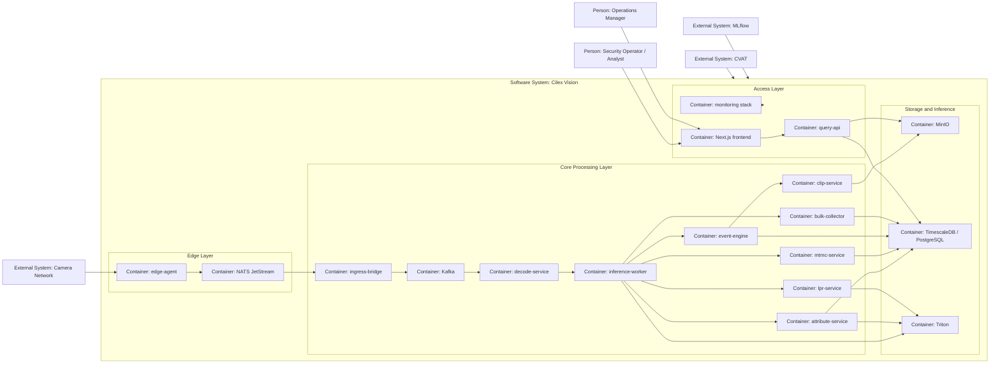

# Cilex Vision Architecture Reference

This section is the engineering-facing architecture reference for the current Cilex Vision platform. It is written for technical evaluators, solution architects, and engineers who need an accurate picture of the system that exists in the repository today.

## Purpose and Scope

Cilex Vision is a multi-camera video analytics platform that turns camera feeds into structured operational data:

- detections
- tracked object movement
- color attributes
- cross-camera identity links
- rule-based events
- investigation clips and thumbnails
- optional license plate results
- operational search and portal views

The implementation follows an edge-to-core design:

- **edge layer** handles RTSP ingest, motion filtering, local buffering, and edge-to-core publish
- **core pipeline** decodes frames, runs inference, stores metadata, and builds search-ready outputs
- **API and UI layer** exposes operational search, topology management, debug workflows, similarity search, LPR search, and multi-site views

## High-Level View

## Document Map

| Document | Purpose |
|---|---|
| [system-context.md](system-context.md) | C4 Level 1 view: external actors and the platform boundary |
| [container-diagram.md](container-diagram.md) | C4 Level 2 view: runtime containers, buses, storage, and service relationships |
| [data-flow.md](data-flow.md) | End-to-end pipeline flow from camera ingest to UI retrieval |
| [security-architecture.md](security-architecture.md) | Trust zones, transport security, RBAC, and audit model |
| [deployment-architecture.md](deployment-architecture.md) | Single-node, multi-node, and multi-site deployment topologies |
| [technology-decisions.md](technology-decisions.md) | ADR summary and the design principles that shape the system |

## Technology Stack Summary

| Area | Technology |
|---|---|
| Edge ingest | Python 3.11+, GStreamer, NATS JetStream |
| Core messaging | Kafka 3.7, Protobuf |
| Inference | NVIDIA Triton Inference Server, TensorRT-backed models |
| Tracking and Re-ID | ByteTrack, OSNet embeddings, FAISS |
| Storage | TimescaleDB on PostgreSQL 16, MinIO |
| API and UI | FastAPI, Next.js 14, React 18, Tailwind CSS |
| Monitoring | Prometheus, Grafana, Loki |
| Security | step-ca, mTLS, Kafka SASL_SSL + SCRAM-SHA-256, JWT RBAC |
| ML and annotation | MLflow, CVAT |
| Deployment automation | Docker Compose, Ansible, Terraform |

## Runtime Notes

The reference documents the implemented repository state, not a future-state target. Three implementation details matter when reading the rest of the reference:

1. **`topology` is a service domain, but its API is currently mounted into `query-api`**
   - The topology models and router live under `services/topology/`.
   - The active FastAPI runtime is `query-api`, which includes the topology router.

2. **Some Kafka contracts are broader than the currently wired runtime**
   - `attributes.jobs` exists in the canonical topic catalog, but the current `attribute-service` consumes `tracklets.local` and writes directly to PostgreSQL.
   - `events.raw` is published by `event-engine`, but `event-engine` also writes the `events` table directly rather than routing event persistence through `bulk-collector`.

3. **The archive topic pair exists, but a dedicated transcode worker is not part of the current 13-service inventory**
   - `clip-service` publishes to `archive.transcode.completed` today as a compatibility signal.
   - The topic pair should be treated as an archive integration lane rather than a fully implemented standalone transcode subsystem.
