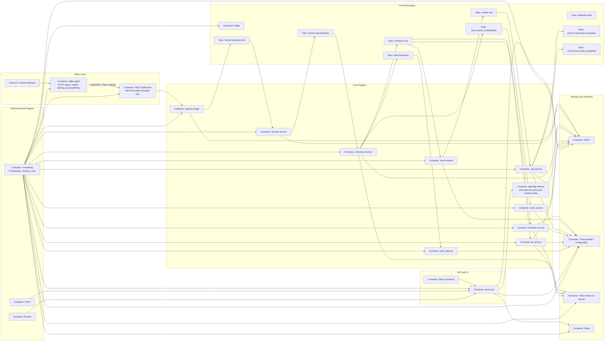

# Container Diagram

This document is the **C4 Level 2** architecture view for Cilex Vision. It expands the system boundary into runtime containers, supporting data stores, message buses, and user-facing entry points.

## Container Grouping

The runtime is easiest to reason about in five groups:

- **Edge Layer**
- **Core Pipeline**
- **Storage and Inference**
- **API and UI**
- **Monitoring and Support**

## C4 Level 2 Diagram

## Container Responsibilities

| Container | Responsibility |
|---|---|
| `edge-agent` | Reads RTSP streams, filters mostly static frames, uploads frame blobs, publishes frame references to NATS, and buffers locally during outages |
| `ingress-bridge` | Moves edge traffic from NATS to Kafka, validates payloads, stamps `core_ingest_ts`, offloads blobs, and spools on failure |
| `decode-service` | Downloads frame blobs, decodes image/video payloads, normalizes color, resizes, and republishes decoded frame references |
| `inference-worker` | Runs YOLOv8 detection, ByteTrack tracking, and OSNet embeddings via Triton |
| `attribute-service` | Extracts color attributes for people and vehicles |
| `event-engine` | Maintains event state machines and emits event records |
| `clip-service` | Generates MP4 clips and thumbnails from decoded frames |
| `mtmc-service` | Links local tracks across cameras using embeddings, topology constraints, and FAISS |
| `bulk-collector` | Writes high-volume Kafka metadata into TimescaleDB via asyncpg COPY |
| `query-api` | Exposes read and management APIs with RBAC, audit logging, and signed URLs |
| `topology` | Provides topology models and topology CRUD router logic |
| `lpr-service` | Performs plate detection and OCR for vehicle tracklets |
| `monitoring` | Collects metrics, dashboards, logs, and alerts |

## Topic Inventory

| Topic | Current producer(s) | Current consumer(s) | Notes |
|---|---|---|---|
| `frames.sampled.refs` | `ingress-bridge` | `decode-service` | Core ingest lane from edge into decode |
| `frames.decoded.refs` | `decode-service` | `inference-worker` | Decoded frame handoff |
| `tracklets.local` | `inference-worker` | `attribute-service`, `event-engine`, `lpr-service` | Site-local track lifecycle stream |
| `bulk.detections` | `inference-worker` | `bulk-collector` | High-volume detection persistence path |
| `attributes.jobs` | Topic catalog defines it; not currently emitted by `attribute-service` | No active runtime consumer in current default wiring | Contract exists, runtime currently writes attributes directly to PostgreSQL |
| `mtmc.active_embeddings` | `inference-worker` | `mtmc-service` | Active Re-ID gallery stream |
| `events.raw` | `event-engine` | `clip-service` | Event bus exists even though `event-engine` also persists events directly |
| `archive.transcode.requested` | `clip-service` | No dedicated active transcode worker in current service inventory | Reserved archive/transcode lane |
| `archive.transcode.completed` | `clip-service` currently emits compatibility records | No dedicated active consumer in current service inventory | Topic contract exists; implementation is transitional |

## Current Implementation Notes

### `attribute-service`

The repository-wide topic contract still reserves `attributes.jobs`, but the current `attribute-service`:

- consumes `tracklets.local`
- fetches frame context from storage and PostgreSQL
- writes aggregated attributes directly to the `track_attributes` table

That direct DB path is the implemented truth today.

### `event-engine`

`event-engine` publishes to `events.raw`, but it also writes the `events` table directly via `EventEmitter`. In other words, Kafka is part of the event pipeline, but event persistence is not currently delegated to `bulk-collector`.

### `topology`

The topology models and router exist under `services/topology/`, but the active deployment path mounts that router inside `query-api` rather than running `topology` as a standalone process.
