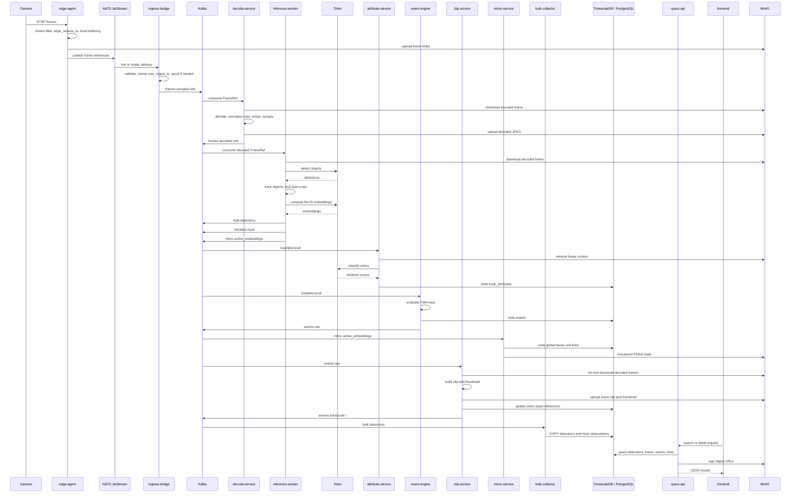

# Data Flow

This document describes the end-to-end data path from camera ingest to user-visible search and investigation outputs.

## Core Rule

**No image or video bytes travel on Kafka.** Kafka messages carry metadata and URI references only. Binary assets live in MinIO buckets such as `frame-blobs`, `decoded-frames`, `event-clips`, `thumbnails`, `debug-traces`, and `mtmc-checkpoints`.

## End-to-End Sequence

## Stage-by-Stage Description

### 1. Camera to edge ingest

- `edge-agent` reads RTSP streams from the camera network
- applies motion filtering to reduce pass-through to roughly 15% in typical planning assumptions
- uploads retained frames to MinIO
- publishes `FrameRef`-style metadata to site-local NATS

### 2. Edge-to-core transfer

- `ingress-bridge` is the core trust boundary
- validates incoming payloads
- stamps `core_ingest_ts`
- builds idempotent Kafka keys
- forwards metadata-only messages into Kafka

### 3. Decode and frame normalization

- `decode-service` downloads frame blobs from MinIO
- decodes JPEG or compressed payloads
- normalizes color handling and output dimensions
- republishes decoded JPEG references to `frames.decoded.refs`

### 4. Inference and tracking

- `inference-worker` retrieves decoded frames
- runs detection in Triton
- updates per-camera tracks using ByteTrack
- computes Re-ID embeddings via OSNet
- publishes:
  - `bulk.detections`
  - `tracklets.local`
  - `mtmc.active_embeddings`

### 5. Sidecar analytics

- `attribute-service` derives color attributes for supported object classes
- `event-engine` opens and closes rule-based events
- `lpr-service` runs optional plate detection and OCR on vehicle tracklets
- `mtmc-service` links local tracks into cross-camera identities

### 6. Persistence

- `bulk-collector` handles high-volume detection persistence via asyncpg COPY
- `attribute-service`, `event-engine`, `mtmc-service`, `clip-service`, and `lpr-service` currently write their own domain tables directly

### 7. Evidence generation

- `clip-service` reacts to closed events
- reconstructs a clip from decoded frames stored in MinIO
- uploads MP4 clips and thumbnails
- updates the event record with asset references

### 8. Search and presentation

- `query-api` reads structured data from TimescaleDB / PostgreSQL
- signs MinIO URLs for evidence retrieval
- exposes search, detail, topology, debug, similarity, and LPR endpoints
- the Next.js frontend renders search, timeline, journey, admin, and portal workflows

## Engineering Latency Budget

The table below is a **budgeting aid** aligned to the existing NFR targets. It is not a statement that every component currently exports a direct measured SLA metric.

### Hot path budget for search-ready metadata

| Stage | Budget target | Notes |
|---|---:|---|
| Camera to edge ingest and filtering | 150 ms | Includes RTSP read, motion decision, and local upload |
| NATS to ingress bridge to Kafka | 100 ms | Includes validation and broker handoff |
| Decode and republish | 150 ms | Download, decode, normalize, upload, and republish |
| Detection, tracking, embedding | 350 ms | Heaviest synchronous compute stage |
| Bulk persistence | 150 ms | COPY-backed persistence path |
| Query API read path | 500 ms | Matches the existing query p95 target |
| Remaining headroom | 600 ms | Buffer for queueing, jitter, and site variance |
| **Total hot-path envelope** | **2,000 ms** | Matches the documented end-to-end p95 target |

### Asynchronous side paths

| Path | Nature |
|---|---|
| `attribute-service` | asynchronous enrichment path; not required for base detection persistence |
| `event-engine` | asynchronous rule-evaluation path |
| `clip-service` | investigation/evidence path; not part of the base 2,000 ms hot path |
| `mtmc-service` | asynchronous cross-camera association path |
| `lpr-service` | optional asynchronous plate-processing path |

## Storage Lifecycle

| Stage | Object representation | Storage location |
|---|---|---|
| Edge retained frame | encoded image/blob | MinIO `frame-blobs` |
| Core decoded frame | normalized JPEG | MinIO `decoded-frames` |
| Detection and track metadata | rows | TimescaleDB / PostgreSQL |
| Event clip | MP4 | MinIO `event-clips` |
| Event thumbnail | JPEG | MinIO `thumbnails` |
| Debug trace | JSON | MinIO `debug-traces` |
| MTMC checkpoint | serialized index snapshot | MinIO `mtmc-checkpoints` |

## Current Implementation Notes

1. **The current runtime is partly hybrid between bus-driven and service-local persistence**
   - `bulk-collector` is the active high-volume write path for detections.
   - `attribute-service` and `event-engine` currently persist their own results directly.

2. **Clip generation is approximate at the frame-window level**
   - The clip pipeline currently relies on MinIO object timestamps rather than a dedicated decoded-frame time index.

3. **The archive topic pair is provisioned ahead of a dedicated worker**
   - It should be read as an archive integration seam, not as a fully separate built subsystem.
