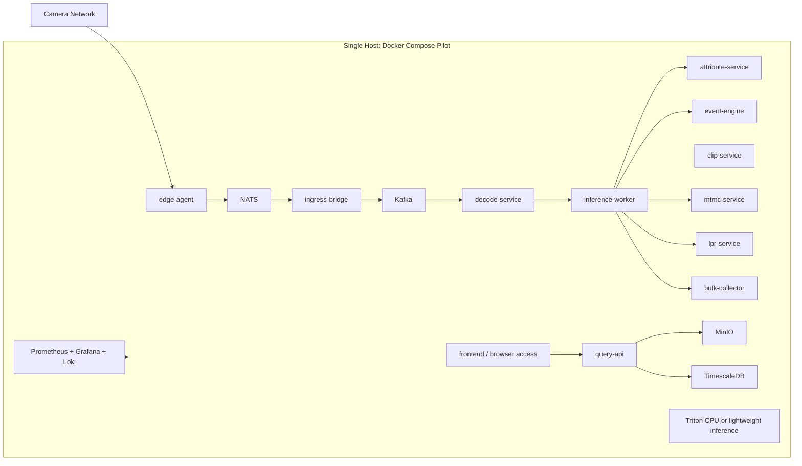
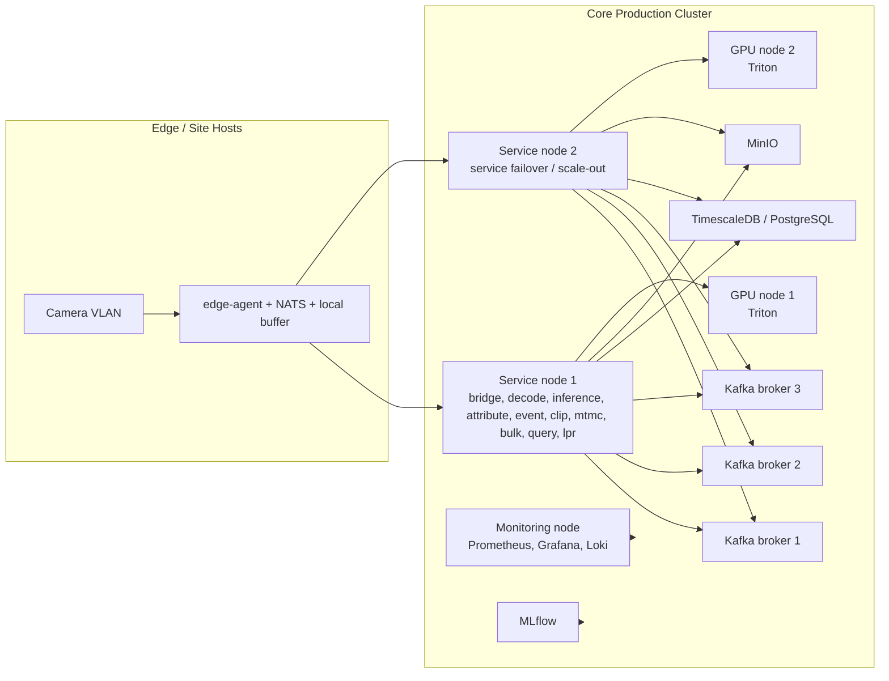
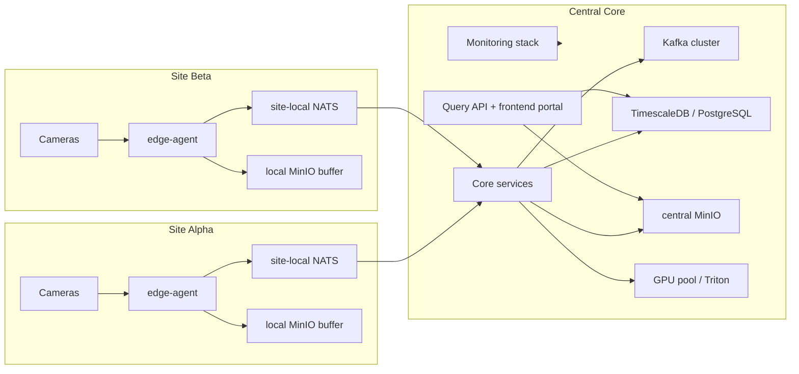
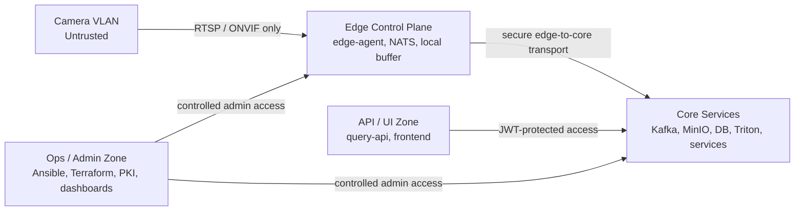

# Deployment Architecture

This document describes the three deployment topologies currently documented in the repository:

1. single-node pilot
2. multi-node production
3. multi-site

For sizing details, see [docs/deployment/hardware-requirements.md](../deployment/hardware-requirements.md).

## 1. Single-Node Pilot

The pilot is a compact Docker Compose deployment intended for evaluation, proof-of-concept work, and local validation.

### Characteristics

| Property | Pilot profile |
|---|---|
| Camera count | 4 |
| GPU | not required |
| Orchestration | Docker Compose |
| Typical use | evaluation, development, proof-of-concept |

## 2. Multi-Node Production

The production topology separates infrastructure roles onto dedicated hosts and is deployed through Ansible, optionally provisioned through Terraform.

### Characteristics

| Property | Multi-node production profile |
|---|---|
| Camera count | 10 to 100+ depending on sizing |
| GPU | dedicated inference hosts |
| Orchestration | Ansible |
| Provisioning | Terraform optional |
| Strength | role separation, operational isolation, better scale and fault containment |

## 3. Multi-Site

The multi-site topology adds one central core plus per-site edge stacks. Site automation is handled by Terraform and Ansible, with per-site PKI isolation.

### Characteristics

| Property | Multi-site profile |
|---|---|
| Site isolation | per-site PKI and edge control plane isolation |
| Centralized functions | Kafka, database, object storage, inference, API, monitoring |
| Site-local functions | edge ingest, local NATS, local buffering, local object spool |
| Provisioning pattern | Terraform `central` + `site` modules |
| Operations pattern | site add/remove playbooks plus onboarding automation |

## Network Zones

## Hardware Guidance Cross-Reference

The architecture shown here aligns to the current deployment guidance:

| Scenario | Primary reference |
|---|---|
| Pilot | [hardware-requirements.md](../deployment/hardware-requirements.md#pilot-4-cameras) |
| Small / single-site production | [hardware-requirements.md](../deployment/hardware-requirements.md#small-10-cameras) |
| Medium / multi-node | [hardware-requirements.md](../deployment/hardware-requirements.md#medium-50-cameras) |
| Large / multi-site | [hardware-requirements.md](../deployment/hardware-requirements.md#large-100-cameras) |

## Current Implementation Notes

- The production and multi-site automation are additive to the pilot path; they do not replace the pilot Compose deployment.
- The multi-site portal exists in the frontend, but some site-management and comparison data still depend on backend APIs and real metrics that are not fully wired.
- The repo includes Jetson edge support, but Jetson should be treated as a deployment variant of `edge-agent`, not a separate logical architecture layer.
