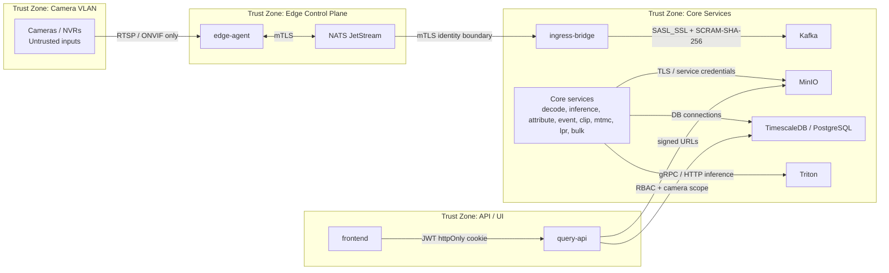

# Security Architecture

This document summarizes the implemented security layers, trust boundaries, transport controls, and audit model for Cilex Vision.

## Trust Zones

## Zone-by-Zone Summary

| Zone | Contains | Primary control |
|---|---|---|
| Camera VLAN | Cameras and NVRs | Network isolation only; treated as untrusted |
| Edge Control Plane | `edge-agent`, site-local NATS | mTLS with CN-based identity |
| Core Services | Kafka, MinIO, database, Triton, core pipeline services | Broker auth, service credentials, internal network controls |
| API / UI | `query-api`, frontend | JWT cookie auth, RBAC, camera scope filtering |

## Identity and Authentication

### Edge identity

- edge-to-NATS trust is certificate-based
- per-site certificates are issued through the internal PKI
- CN-based identity is used for site-scoped NATS authorization

### Core messaging identity

- Kafka uses `SASL_SSL` with `SCRAM-SHA-256`
- authorization is principal-based rather than client-certificate-based
- topic and group access are granted per service principal

### API identity

- user-facing access is mediated by `query-api`
- JWTs are carried in an httpOnly cookie
- the active roles are:
  - `admin`
  - `operator`
  - `viewer`
  - `engineering`

### Authorization model

- role gates protect route groups and sensitive workflows
- camera-scope filtering limits non-admin users to assigned camera sets
- `admin` bypasses camera scope in current API behavior

## PKI and Certificate Model

| Component | Current design |
|---|---|
| Internal CA | Smallstep `step-ca` |
| Site isolation | Per-site certificate issuance and identity boundary |
| NATS auth model | mTLS with `verify_and_map` |
| Bootstrap | `infra/pki/bootstrap-site.sh` |
| Multi-site pattern | Site-specific certs and per-site operational identity |

## Transport Security

| Path | Protection |
|---|---|
| Camera to edge | Device credentials and network isolation; camera data treated as untrusted |
| Edge to NATS | mTLS |
| NATS to ingress-bridge | mTLS |
| Core services to Kafka | `SASL_SSL` + `SCRAM-SHA-256` |
| Core services to MinIO | internal service credentials |
| API to browser | HTTPS expected at deployment edge; JWT in httpOnly cookie |
| Query API to evidence assets | signed MinIO URLs with expiry |

## Audit and Accountability

The current audit model centers on the `audit_logs` table and middleware-based API logging.

| Area | Current behavior |
|---|---|
| API request audit | Query API middleware writes access records |
| User attribution | user ID and username are attached from JWT claims |
| Sensitive routes | debug, topology, similarity, and LPR routes are all role-gated |
| Evidence access | evidence is exposed through signed URLs rather than static public object paths |

## Data Protection Controls

| Control | Current posture |
|---|---|
| Retention windows | Documented and increasingly automated through DB retention and MinIO lifecycle policies |
| Evidence access | Signed URL model |
| Debug access | `engineering` and `admin` only for debug traces |
| Per-camera tenancy boundary | Enforced in `query-api` for non-admin users |
| Backup and DR | Documented and automated through dedicated backup/restore tooling |

## Security-Relevant Design Principles

1. **Treat camera-originated input as untrusted**
   - camera clocks and device metadata are advisory only
   - trusted ordering begins at `edge_receive_ts`

2. **Separate edge and core trust domains**
   - edge uses NATS and local buffering
   - core uses Kafka and persistent services

3. **Keep blob data out of Kafka**
   - reduce broker risk surface and prevent large-message operational failure modes

4. **Expose object storage through signed URLs**
   - browser or operator access never receives raw internal MinIO credentials

5. **Restrict operational visibility by role and camera scope**
   - the API is the access boundary for human users

## Current Implementation Notes

- The topology API is role-gated, but camera-scope behavior for `/topology/*` and `/debug/*` remains an open review item in the deployment TODO ledger.
- Query API role enforcement is active, but the platform still lacks a first-class token issuance/login endpoint in the repo.
- LPR search is currently more restrictive than the general read API and is limited to `admin` and `operator`.
