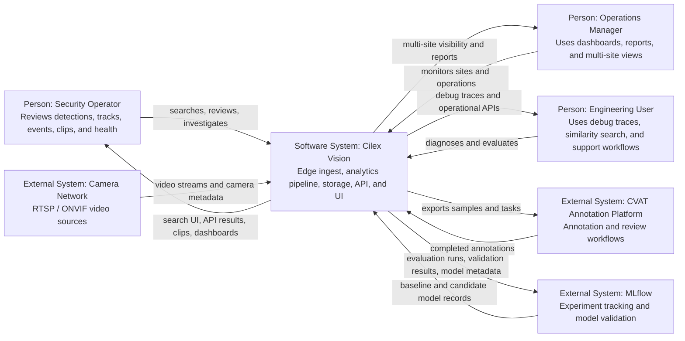

# System Context

This document is the **C4 Level 1** architecture view for Cilex Vision. It shows the platform as a single software system and focuses on its external actors and integrations.

## Scope

At this level, Cilex Vision is treated as one system boundary. Internal services such as `edge-agent`, `query-api`, `mtmc-service`, and `clip-service` are intentionally not expanded here; they appear in the container view.

## C4 Level 1 Diagram

## External Actors

| Actor | Role |
|---|---|
| Security Operator | Uses the platform for real-time awareness, investigation, and evidence retrieval |
| Operations Manager | Uses dashboards, reports, and cross-site views to manage service quality and operational performance |
| Engineering User | Uses debug, similarity, shadow, and evaluation workflows to diagnose or improve the system |

## External Systems

| External system | Relationship to Cilex Vision |
|---|---|
| Camera Network | Supplies RTSP video streams and ONVIF-accessible camera metadata or capability information |
| CVAT Annotation Platform | Receives curated examples and validation tasks; returns human-reviewed annotations |
| MLflow | Stores experiment tracking, validation outcomes, and model rollout metadata |

## System Responsibilities

At the system boundary, Cilex Vision provides five high-level capabilities:

1. **Ingest and normalize camera data**
   - receive camera streams
   - suppress low-value frames at the edge
   - transfer metadata into the core pipeline

2. **Produce machine-readable analytics**
   - detect objects
   - track movement
   - generate embeddings, attributes, events, clips, and optional plate reads

3. **Persist operational history**
   - store detections, tracks, events, links, and evidence references
   - retain objects and metadata according to platform policy

4. **Expose investigation and management interfaces**
   - REST API
   - web UI
   - multi-site portal
   - engineering debug and similarity workflows

5. **Support operational governance**
   - monitoring and alerting
   - audit logging
   - deployment automation
   - backup, restore, and recovery procedures

## Current Implementation Notes

- The platform does **not** include face recognition or named-person identity lookup.
- Multi-site portal pages exist in the frontend, but some site-management and comparison metrics still depend on backend work that is not fully wired yet.
- LPR exists as an optional service and is feature-flagged rather than always-on.
