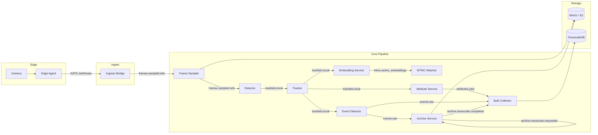

# Kafka Topic Contract & Partitioning Plan

This document defines the complete contract for every Kafka topic in the Cilex Vision Multi-Camera Video Analytics Platform. It specifies producers, consumers, message formats, partition key rationale, ordering guarantees, and retention policies.

**CRITICAL RULE:** No image/video bytes on Kafka — only URI references (object store paths). See [ADR-002](adr/ADR-002-kafka-partitioning.md) for the design rationale.

**Related documents:**

- [Taxonomy & Requirements](taxonomy.md) — object classes, events, NFRs
- [ADR-002: Kafka Partitioning](adr/ADR-002-kafka-partitioning.md) — design decisions
- [Protobuf schemas](../proto/) — message definitions
- [Topic definitions](../infra/kafka/topics.yaml) — machine-readable topic list

---

## 1. Cluster Defaults

| Parameter | Value | Rationale |
|-----------|-------|-----------|
| Replication factor | 3 | Tolerate loss of 1 broker without data loss |
| `min.insync.replicas` | 2 | Acknowledge writes only when 2 of 3 replicas confirm |
| Producer `acks` | `all` | Required by min.insync.replicas for durability |
| Compression | `zstd` | Best compression ratio for protobuf payloads |
| Message max size | 1 MB (default) | All messages are metadata/refs, well under limit |
| Schema Registry | Confluent Schema Registry, protobuf format | Compatibility mode: BACKWARD per subject |

---

## 2. Topic Data Flow

The following diagram shows how data flows through the Kafka topics across pipeline services.



---

## 3. Topic Contracts

### 3.1 `frames.sampled.refs`

| Property | Value |
|----------|-------|
| **Partitions** | 12 |
| **Partition key** | `camera_id` (string) |
| **Cleanup policy** | delete |
| **Retention** | 2 hours |
| **Value schema** | `vidanalytics.v1.frame.FrameRef` |
| **Compression** | zstd |

**Producers:**

| Service | Trigger |
|---------|---------|
| Ingress Bridge | On receipt of a sampled frame from the edge agent via NATS. The bridge writes the frame bytes to MinIO and publishes a `FrameRef` with the resulting URI. |

**Consumers:**

| Service | Consumer Group | Purpose |
|---------|---------------|---------|
| Detection Inference Worker | `detector-worker` | Retrieves frame from URI, runs object detection model, produces results downstream |
| Bulk Collector | `bulk-collector-frames` | Persists frame metadata to TimescaleDB for query API |
| Debug Trace Pipeline | `debug-trace-sampler` | Samples frames for end-to-end latency tracing |

**Message format:**

```protobuf
message FrameRef {
  string frame_id = 1;          // UUID v4
  string camera_id = 2;         // partition key
  string frame_uri = 3;         // s3://raw-video/cam1/frame-0001.jpg (NEVER raw bytes)
  uint64 frame_sequence = 4;    // monotonic per camera
  VideoTimestamp timestamps = 5; // source_capture_ts, edge_receive_ts, core_ingest_ts
  uint32 width_px = 6;
  uint32 height_px = 7;
  string codec = 8;
}
```

**Ordering guarantees:**
- All frames from a single camera are in the same partition (keyed by `camera_id`).
- Within a partition, `frame_sequence` is monotonically increasing per camera.
- Consumers relying on frame ordering MUST process frames within a partition sequentially.

**Key rationale:**
`camera_id` ensures per-camera frame ordering, which is required by the detector (frames must arrive in capture order for temporal consistency) and by the tracker (which initialises tracks from sequential detections). With 12 partitions and a pilot of 4 cameras, each camera hashes to a dedicated partition with headroom for scaling to ~12 cameras before rebalancing.

---

### 3.2 `tracklets.local`

| Property | Value |
|----------|-------|
| **Partitions** | 12 |
| **Partition key** | `camera_id` (string) |
| **Cleanup policy** | delete |
| **Retention** | 6 hours |
| **Value schema** | `vidanalytics.v1.tracklet.Tracklet` |
| **Compression** | zstd |

**Producers:**

| Service | Trigger |
|---------|---------|
| Tracker Service | On every tracking update: new track, state change, or trajectory point addition. Publishes the full current Tracklet state. |

**Consumers:**

| Service | Consumer Group | Purpose |
|---------|---------------|---------|
| Attribute Service | `attr-worker` | Extracts attribute crops from active tracks for color classification |
| Embedding Service | `embed-worker` | Computes re-ID embeddings from tracklet crops |
| Event Detector | `event-detector` | Evaluates event trigger/close conditions against track state |
| Bulk Collector | `bulk-collector-tracklets` | Persists track metadata to TimescaleDB |
| MTMC Matcher | `mtmc-matcher-tracklets` | Reads terminated tracks for cross-camera association |

**Message format:**

```protobuf
message Tracklet {
  string track_id = 1;              // UUID v4
  string camera_id = 2;             // partition key
  ObjectClass object_class = 3;     // majority-vote class
  TrackletState state = 4;          // NEW -> ACTIVE -> LOST -> TERMINATED
  repeated TrajectoryPoint trajectory = 5;
  float mean_confidence = 6;
  VideoTimestamp timestamps = 7;
  string tracker_version = 8;
}
```

**Ordering guarantees:**
- All tracklets from a single camera are in the same partition (keyed by `camera_id`).
- State transitions for a given `track_id` are ordered within the partition because a single camera's tracks are produced by one tracker instance.
- Consumers MUST process state transitions in order: `NEW -> ACTIVE -> LOST -> TERMINATED`. Receiving a `TERMINATED` before `ACTIVE` indicates a processing error.

**Key rationale:**
`camera_id` (not `track_id`) is used because: (1) a single camera produces multiple concurrent tracks that share a tracker instance — ordering them together preserves inter-track relationships; (2) track IDs are generated at runtime and would scatter across partitions, breaking the tracker's single-writer guarantee; (3) downstream consumers (event detector, attribute service) process tracks in camera context.

---

### 3.3 `attributes.jobs`

| Property | Value |
|----------|-------|
| **Partitions** | 6 |
| **Partition key** | `local_track_id` (string) |
| **Cleanup policy** | delete |
| **Retention** | 2 hours |
| **Value schema** | `vidanalytics.v1.attribute.Attribute` |
| **Compression** | zstd |

**Producers:**

| Service | Trigger |
|---------|---------|
| Attribute Service | After running attribute classification (color) on a detection crop. Publishes one `Attribute` message per attribute type per detection. |

**Consumers:**

| Service | Consumer Group | Purpose |
|---------|---------------|---------|
| Bulk Collector | `bulk-collector-attrs` | Persists attribute results to TimescaleDB for query API |
| MTMC Matcher | `mtmc-matcher-attrs` | Uses attributes as soft features for cross-camera matching |

**Message format:**

```protobuf
message Attribute {
  string attribute_id = 1;     // UUID v4
  string detection_id = 2;     // parent detection
  string track_id = 3;         // partition key (local_track_id)
  AttributeType attribute_type = 4;
  Color color_value = 5;
  float confidence = 6;
  float quality_score = 7;
  string model_name = 8;
  string model_version = 9;
}
```

**Ordering guarantees:**
- All attributes for a single track are in the same partition (keyed by `local_track_id`).
- Within a partition, attributes are ordered by production time, but there is no strict temporal ordering requirement — attributes are independent observations.

**Key rationale:**
`local_track_id` groups all attribute results for a track together. This enables the bulk collector to efficiently batch-write attributes per track and allows the MTMC matcher to build a complete attribute profile without cross-partition joins. 6 partitions is sufficient because attribute extraction is less throughput-intensive than frame or tracklet processing.

---

### 3.4 `mtmc.active_embeddings`

| Property | Value |
|----------|-------|
| **Partitions** | 12 |
| **Partition key** | `local_track_id` (string) |
| **Cleanup policy** | compact |
| **Retention** | infinite (compacted) |
| **Value schema** | `vidanalytics.v1.embedding.Embedding` |
| **Compression** | zstd |

**Producers:**

| Service | Trigger |
|---------|---------|
| Embedding Service | On computing or updating a re-ID embedding for a tracked object. Publishes the latest embedding vector. |
| Tracker Service | On track termination, publishes a **tombstone** (null value) with the `local_track_id` as key, so the compactor removes the stale embedding. |

**Consumers:**

| Service | Consumer Group | Purpose |
|---------|---------------|---------|
| MTMC Matcher | `mtmc-gallery` | Materialises an in-memory gallery of all active embeddings. On tombstone receipt, removes the entry. Performs nearest-neighbor search for cross-camera matching. |

**Message format:**

```protobuf
message Embedding {
  string embedding_id = 1;         // UUID v4
  string source_id = 2;            // local_track_id (partition key via message key)
  EmbeddingSourceType source_type = 3;
  repeated float vector = 4;       // dense embedding, length == dimension
  uint32 dimension = 5;            // e.g. 512
  string model_name = 6;
  string model_version = 7;
  float quality_score = 8;
}
```

**Ordering guarantees:**
- Compacted topic: only the latest value per key (`local_track_id`) is retained after compaction.
- A tombstone (null value) for a key signals track termination and eventual removal from the log.
- Consumers rebuilding state from the beginning of the topic will see a consistent snapshot of all active embeddings after consuming to the end.

**Key rationale:**
`local_track_id` is the natural compaction key — each track has exactly one "current" embedding. Compaction ensures the topic does not grow unboundedly: terminated tracks are tombstoned and eventually removed. 12 partitions match the tracklet topic to support parallelism in the MTMC matcher.

**Compaction configuration:**

| Parameter | Value | Rationale |
|-----------|-------|-----------|
| `min.compaction.lag.ms` | 3600000 (1 h) | Ensure consumers have time to read updates before compaction removes old values |
| `delete.retention.ms` | 86400000 (24 h) | Tombstones retained for 24 h so lagging consumers can observe track terminations |
| `segment.ms` | 3600000 (1 h) | Compact segments hourly to keep the log trim |

---

### 3.5 `events.raw`

| Property | Value |
|----------|-------|
| **Partitions** | 6 |
| **Partition key** | `event_id` (string) |
| **Cleanup policy** | delete |
| **Retention** | 7 days |
| **Value schema** | `vidanalytics.v1.event.Event` |
| **Compression** | zstd |

**Producers:**

| Service | Trigger |
|---------|---------|
| Event Detector | On event state transitions: creation (NEW), activation (ACTIVE), sub-state changes (STOPPED), and closure (CLOSED). Each state change publishes the full Event message with the same `event_id` key. |

**Consumers:**

| Service | Consumer Group | Purpose |
|---------|---------------|---------|
| Bulk Collector | `bulk-collector-events` | Persists event records to TimescaleDB. Upserts on `event_id` to handle state updates. |
| Archive Service | `archive-trigger` | On CLOSED events, triggers clip transcode if `clip_uri` references a raw segment. |
| Query API (optional) | `query-api-events` | Real-time event streaming to WebSocket clients |

**Message format:**

```protobuf
message Event {
  string event_id = 1;           // UUID v4, partition key
  EventType event_type = 2;      // ENTERED_SCENE, EXITED_SCENE, STOPPED, etc.
  string track_id = 3;           // empty for camera-level events
  string camera_id = 4;
  Timestamp start_time = 5;
  Timestamp end_time = 6;        // unset while active
  int64 duration_ms = 7;
  string clip_uri = 8;           // URI reference — NEVER raw video bytes
  EventState state = 9;          // NEW -> ACTIVE -> CLOSED
  repeated string track_ids = 10;
  VideoTimestamp timestamps = 11;
}
```

**Ordering guarantees:**
- All state updates for a single event are in the same partition (keyed by `event_id`).
- State transitions must be consumed in order: `NEW -> ACTIVE -> STOPPED_SUBSTATE -> EXITED -> CLOSED`.
- Events from different cameras or tracks may interleave within a partition — consumers MUST NOT assume per-camera ordering on this topic.

**Key rationale:**
`event_id` (not `camera_id`) because: (1) the primary ordering requirement is event lifecycle consistency — all state updates for one event must be ordered; (2) keying by `camera_id` would create hot partitions in deployments with few cameras; (3) consumers that need per-camera ordering should use the `camera_id` field to group after consumption. 6 partitions is appropriate for the expected event volume (events are much lower frequency than frames or tracklets).

---

### 3.6 `archive.transcode.requested`

| Property | Value |
|----------|-------|
| **Partitions** | 4 |
| **Partition key** | `camera_id` (string) |
| **Cleanup policy** | delete |
| **Retention** | 24 hours |
| **Value schema** | `vidanalytics.v1.frame.FrameRef` |
| **Compression** | zstd |

**Producers:**

| Service | Trigger |
|---------|---------|
| Archive Service | When an event closes and the associated `clip_uri` points to a raw (non-transcoded) video segment, the archive service publishes a transcode request containing a `FrameRef` with the source segment URI. |

**Consumers:**

| Service | Consumer Group | Purpose |
|---------|---------------|---------|
| Transcode Worker | `transcode-worker` | Reads source segment from MinIO, transcodes to archival format (H.264 baseline), writes output to MinIO, publishes completion to `archive.transcode.completed`. |

**Message format:** Reuses `FrameRef` protobuf — `frame_uri` points to the source segment to be transcoded.

**Ordering guarantees:**
- Requests for a single camera are ordered within the same partition.
- This prevents concurrent transcodes from the same camera from overwhelming a single worker.
- No cross-camera ordering requirement.

**Key rationale:**
`camera_id` ensures a single camera's transcode jobs are serialised within a partition, preventing resource contention. 4 partitions is sufficient for the pilot (4 cameras) and limits transcode parallelism to a manageable level.

---

### 3.7 `archive.transcode.completed`

| Property | Value |
|----------|-------|
| **Partitions** | 4 |
| **Partition key** | `camera_id` (string) |
| **Cleanup policy** | delete |
| **Retention** | 24 hours |
| **Value schema** | `vidanalytics.v1.frame.FrameRef` |
| **Compression** | zstd |

**Producers:**

| Service | Trigger |
|---------|---------|
| Transcode Worker | After completing a transcode job. The `FrameRef.frame_uri` points to the transcoded output segment in MinIO. |

**Consumers:**

| Service | Consumer Group | Purpose |
|---------|---------------|---------|
| Archive Service | `archive-completion` | Updates clip metadata with the transcoded URI, marks the transcode job as done. |
| Bulk Collector | `bulk-collector-archive` | Persists archive metadata to TimescaleDB. |

**Message format:** Reuses `FrameRef` protobuf — `frame_uri` points to the transcoded output segment.

**Ordering guarantees:**
- Completions for a single camera are ordered, matching the request partition scheme.
- Consumers can correlate request/completion pairs using `frame_id`.

**Key rationale:**
Mirrors `archive.transcode.requested` partitioning for symmetry. Keying by `camera_id` ensures the archive service processes completions in the same order requests were issued.

---

## 4. Partition Key Summary

| Topic | Key | Rationale |
|-------|-----|-----------|
| `frames.sampled.refs` | `camera_id` | Per-camera frame ordering for detector and tracker |
| `tracklets.local` | `camera_id` | Per-camera track state ordering; preserves single-writer guarantee |
| `attributes.jobs` | `local_track_id` | Groups all attributes per track for efficient batch writes |
| `mtmc.active_embeddings` | `local_track_id` | Natural compaction key; one embedding per track |
| `events.raw` | `event_id` | Per-event lifecycle ordering; avoids hot partitions |
| `archive.transcode.requested` | `camera_id` | Serialises transcode jobs per camera |
| `archive.transcode.completed` | `camera_id` | Mirrors request partitioning for correlation |

---

## 5. Retention & Cleanup Summary

| Topic | Cleanup | Retention | Rationale |
|-------|---------|-----------|-----------|
| `frames.sampled.refs` | delete | 2 h | Frames are consumed rapidly by detector; URI persists in MinIO |
| `tracklets.local` | delete | 6 h | Longer than frames — allows replay for missed events or reprocessing |
| `attributes.jobs` | delete | 2 h | Attributes are small and consumed quickly by bulk collector |
| `mtmc.active_embeddings` | compact | infinite | Gallery must persist for cross-camera matching of active tracks |
| `events.raw` | delete | 7 d | Events are the primary business output; longer retention for debugging and replay |
| `archive.transcode.requested` | delete | 24 h | Transcode jobs should complete well within 24 h |
| `archive.transcode.completed` | delete | 24 h | Completion records consumed by archive service shortly after production |

---

## 6. Consumer Group Conventions

Consumer group IDs follow the pattern: `{service-name}` or `{service-name}-{topic-suffix}`.

| Consumer Group | Service | Topics |
|----------------|---------|--------|
| `detector-worker` | Detection Inference Worker | `frames.sampled.refs` |
| `bulk-collector-frames` | Bulk Collector | `frames.sampled.refs` |
| `bulk-collector-tracklets` | Bulk Collector | `tracklets.local` |
| `bulk-collector-attrs` | Bulk Collector | `attributes.jobs` |
| `bulk-collector-events` | Bulk Collector | `events.raw` |
| `bulk-collector-archive` | Bulk Collector | `archive.transcode.completed` |
| `attr-worker` | Attribute Service | `tracklets.local` |
| `embed-worker` | Embedding Service | `tracklets.local` |
| `event-detector` | Event Detector | `tracklets.local` |
| `mtmc-gallery` | MTMC Matcher | `mtmc.active_embeddings` |
| `mtmc-matcher-tracklets` | MTMC Matcher | `tracklets.local` |
| `mtmc-matcher-attrs` | MTMC Matcher | `attributes.jobs` |
| `archive-trigger` | Archive Service | `events.raw` |
| `archive-completion` | Archive Service | `archive.transcode.completed` |
| `transcode-worker` | Transcode Worker | `archive.transcode.requested` |
| `debug-trace-sampler` | Debug Trace Pipeline | `frames.sampled.refs` |
| `query-api-events` | Query API | `events.raw` |

---

## 7. Producer Requirements

All Kafka producers in the platform MUST adhere to these requirements:

1. **Idempotent production:** Enable `enable.idempotence=true` to guarantee exactly-once delivery within a partition.
2. **Serialisation:** All values serialised as protobuf using the Schema Registry serialiser. Keys are UTF-8 strings.
3. **Three timestamps:** Every message MUST populate all three fields in `VideoTimestamp` before publishing: `source_capture_ts`, `edge_receive_ts`, `core_ingest_ts`.
4. **No raw bytes:** Messages MUST NOT contain image or video bytes — only URI references to object storage.
5. **Acks:** Producers MUST set `acks=all` to ensure durability with `min.insync.replicas=2`.
6. **Compression:** Producers SHOULD use `compression.type=zstd` for bandwidth efficiency.
7. **Headers:** Every message MUST include the header `x-proto-schema` with the fully qualified protobuf message name (e.g., `vidanalytics.v1.frame.FrameRef`).

---

## 8. Consumer Requirements

All Kafka consumers MUST adhere to these requirements:

1. **Consumer lag monitoring:** Every consumer group MUST export `kafka_consumer_lag{group, topic}` as a Prometheus gauge. Alert threshold: > 10,000 messages for > 60 s (per NFR in taxonomy.md §4).
2. **Graceful rebalance:** Consumers MUST handle partition revocation gracefully — commit offsets and flush in-progress work before yielding partitions.
3. **Deserialization validation:** Consumers MUST validate that `len(vector) == dimension` for embedding messages and that required fields are non-empty.
4. **Dead letter queue:** Messages that fail deserialization or processing after 3 retries MUST be published to a `{topic}.dlq` dead-letter topic for manual inspection.
5. **Idempotent processing:** Consumers that write to TimescaleDB MUST use upsert semantics (ON CONFLICT) to handle redeliveries.

---

## 9. Schema Evolution Rules

1. All topic value schemas are registered in the Confluent Schema Registry with **BACKWARD** compatibility mode.
2. Adding optional fields to a protobuf message is always backward-compatible.
3. Removing or renaming fields is a **breaking change** — requires a new topic version (e.g., `frames.sampled.refs.v2`) and a migration plan.
4. Enum values MUST NOT be renumbered. New values are appended at the end.
5. The `buf breaking --against .git#branch=main` check enforces FILE-level compatibility on all `.proto` files.

---

## 10. Operational Procedures

### 10.1 Adding a New Topic

1. Add the topic entry to `infra/kafka/topics.yaml`.
2. Run `python infra/kafka/create-topics.py --bootstrap-servers <brokers>` — the script is idempotent.
3. Register the value schema in Schema Registry.
4. Update this document with the full contract (producers, consumers, key rationale).
5. Create or update the corresponding protobuf message in `proto/`.
6. Run `buf lint` and `buf breaking` to verify compatibility.

### 10.2 Changing Partition Count

Increasing partitions is a **non-reversible** operation and breaks key-based ordering guarantees for in-flight data. Procedure:

1. Drain all consumer groups to zero lag.
2. Stop all producers for the topic.
3. Increase partitions via `kafka-topics.sh --alter`.
4. Restart producers and consumers.
5. Monitor for ordering anomalies in the first retention window.

### 10.3 Monitoring

| Metric | Source | Alert Condition |
|--------|--------|-----------------|
| `kafka_consumer_lag` | Consumer client library | > 10,000 for > 60 s |
| `kafka_topic_partition_count` | Cluster JMX / Prometheus exporter | Deviates from `topics.yaml` |
| `kafka_under_replicated_partitions` | Broker JMX | > 0 for > 120 s |
| `kafka_messages_in_per_sec` | Broker JMX | Anomaly detection (±3 sigma from rolling mean) |

---

## 11. Acceptance Criteria

### Automated (checked by `review.sh`)

- [ ] File `docs/kafka-contract.md` exists and is > 100 lines
- [ ] YAML front-matter `status:` is set to `P0-D03` (not `STUB`)
- [ ] Placeholder warning (stub banner) is absent
- [ ] File `infra/kafka/topics.yaml` exists and is valid YAML
- [ ] File `infra/kafka/create-topics.py` exists and is executable
- [ ] All 7 topics from the task spec are defined in `topics.yaml`
- [ ] Mermaid diagram is present (data flow)

### Human Review

- [ ] Every topic has: producers, consumers, message format, ordering guarantees, key rationale
- [ ] No topic carries raw image or video bytes — only URI references
- [ ] Partition key choices are justified with concrete reasoning
- [ ] Consumer groups are listed with their topics
- [ ] Schema evolution rules are specified
- [ ] `create-topics.py` is idempotent (existing topics are skipped)
- [ ] Retention values match `topics.yaml`
- [ ] Three timestamps requirement is documented in producer requirements
- [ ] Mermaid diagram renders correctly (verify at mermaid.live)
