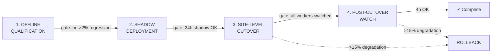

# Model Rollout & Cutover SOP

This Standard Operating Procedure governs how detector, tracker, and Re-ID models are updated in the Cilex Vision pipeline. It applies to all three Triton-served models (`yolov8l`, `osnet`, `color_classifier`) and the CPU-side tracker (`ByteTrack`).

**Related documents:**

- `docs/triton-placement.md` — VRAM budget, EXPLICIT mode (ADR-005), shadow deployment lifecycle
- `docs/security-design.md` — SASL_SSL, mTLS for all management channels
- `docs/bakeoff-results/detector-comparison.md` — YOLOv8-L baseline selection
- `docs/bakeoff-results/tracker-comparison.md` — BoT-SORT recommendation
- `infra/triton/models/*/config.pbtxt` — Triton model configurations
- `infra/prometheus/rules/triton-alerts.yml` — Triton alert rules
- ADR-005: Triton EXPLICIT model control
- ADR-008: Model version boundary (Re-ID embedding incompatibility)

**Scope:** This SOP covers Triton-served models and the CPU tracker. It does NOT cover pipeline software updates, database migrations, or Kafka topic changes.

---

## Overview: Four-Stage Process



| Stage | Duration | Who | Rollback Window |
|-------|----------|-----|-----------------|
| 1. Offline Qualification | 1-2 days | ML engineer | N/A — no production impact |
| 2. Shadow Deployment | 24-48 hours minimum | ML engineer + SRE | Unload shadow version |
| 3. Site-Level Cutover | ~5 minutes (~30 s blackout for Re-ID) | SRE (coordinated) | Switch traffic back to old version |
| 4. Post-Cutover Watch | 4 hours minimum | SRE on-call | Full rollback to previous version |

---

## Stage 1: Offline Qualification

**Purpose:** Evaluate the candidate model against the current baseline on all evaluation slices. No production impact.

### Prerequisites

- [ ] Candidate ONNX model exported and available
- [ ] Evaluation dataset exists at `data/eval/` with `manifest.json`
- [ ] MLflow tracking server accessible
- [ ] Current baseline metrics recorded in MLflow

### Procedure

#### 1.1 Build TensorRT engine

Build the candidate engine for the target GPU. Use dynamic shapes matching `config.pbtxt`.

**Detector example (yolov8l replacement):**

```bash
trtexec \
  --onnx=candidate_detector.onnx \
  --saveEngine=model.plan \
  --fp16 \
  --minShapes=images:1x3x640x640 \
  --optShapes=images:4x3x640x640 \
  --maxShapes=images:8x3x640x640 \
  --workspace=1024
```

**Re-ID example (osnet replacement):**

```bash
trtexec \
  --onnx=candidate_reid.onnx \
  --saveEngine=model.plan \
  --fp16 \
  --minShapes=images:1x3x256x128 \
  --optShapes=images:16x3x256x128 \
  --maxShapes=images:32x3x256x128 \
  --workspace=512
```

**Color classifier example:**

```bash
trtexec \
  --onnx=candidate_color.onnx \
  --saveEngine=model.plan \
  --fp16 \
  --minShapes=images:1x3x224x224 \
  --optShapes=images:16x3x224x224 \
  --maxShapes=images:32x3x224x224 \
  --workspace=512
```

#### 1.2 Run bake-off evaluation

**Detector:**

```bash
python3 scripts/bakeoff/run_detector_bakeoff.py \
  --model-path candidate_detector/model.plan \
  --triton-url localhost:8001 \
  --eval-dir data/eval/detector \
  --experiment detector-bakeoff \
  --run-name "candidate-$(date +%Y%m%d)"
```

**Tracker:**

```bash
python3 scripts/bakeoff/run_tracker_bakeoff.py \
  --tracker botsort \
  --detector yolov8l \
  --gt data/eval/mot/manifest.json \
  --experiment tracker-bakeoff
```

#### 1.3 Compare against baseline

```bash
python3 scripts/bakeoff/compare_bakeoff.py \
  --phase detector \
  --experiment detector-bakeoff \
  --output docs/bakeoff-results/detector-comparison-candidate.md
```

#### 1.4 Query MLflow for regression check

```bash
# Retrieve baseline and candidate run metrics
mlflow runs search \
  --experiment-name detector-bakeoff \
  --order-by "metrics.composite_score DESC" \
  --max-results 2
```

### Gate Criteria — Stage 1

| Criterion | Threshold | How to Verify |
|-----------|-----------|---------------|
| No metric regression > 2% | `(baseline - candidate) / baseline < 0.02` for all primary metrics | MLflow metric comparison |
| mAP@0.5:0.95 (detector) | candidate >= baseline * 0.98 | MLflow `metrics.mAP_0.5_0.95` |
| IDF1 (tracker) | candidate >= baseline * 0.98 | MLflow `metrics.IDF1` |
| Throughput | candidate FPS >= baseline FPS * 0.90 | `trtexec` benchmark output |
| TensorRT build | Engine builds successfully on target GPU | Build exit code 0 |
| All eval slices pass | No per-class regression > 5% | Bake-off comparison report |

### Checklist — Stage 1

```markdown
## Stage 1 Checklist: Offline Qualification

- [ ] Model: _________________ Version: _____
- [ ] Target model slot: yolov8l / osnet / color_classifier
- [ ] ONNX export validated (correct input/output shapes)
- [ ] TensorRT engine built successfully for target GPU
- [ ] Bake-off evaluation completed, logged to MLflow
- [ ] Experiment name: _________________
- [ ] Baseline run ID: _________________
- [ ] Candidate run ID: _________________
- [ ] No primary metric regression > 2%:
  - [ ] mAP/IDF1: baseline=_____ candidate=_____ delta=_____%
- [ ] No per-class regression > 5%
- [ ] Throughput: baseline=_____ FPS, candidate=_____ FPS
- [ ] Comparison report generated at: _________________
- [ ] Approved by: _________________ Date: _________
```

---

## Stage 2: Shadow Deployment

**Purpose:** Run the candidate model alongside the production model with real traffic. Compare outputs for accuracy, latency, and error rate over 24-48 hours.

### Prerequisites

- [ ] Stage 1 gate criteria met and approved
- [ ] Target Triton server accessible (EXPLICIT mode, ADR-005)
- [ ] Shadow comparison dashboard configured in Grafana
- [ ] Sufficient VRAM headroom (see `docs/triton-placement.md` section 9 — worst case +185 MB for yolov8l shadow)

### Procedure

#### 2.1 Upload candidate engine to model repository

Place the new engine in the next version directory:

```bash
# Determine current version
CURRENT_VER=$(ls -1 /models/{MODEL_NAME}/ | grep -E '^[0-9]+$' | sort -n | tail -1)
NEW_VER=$((CURRENT_VER + 1))

# Copy engine to new version directory
mkdir -p /models/{MODEL_NAME}/${NEW_VER}/
cp candidate/model.plan /models/{MODEL_NAME}/${NEW_VER}/model.plan
```

#### 2.2 Load the shadow version

The `version_policy { latest { num_versions: 2 } }` in each `config.pbtxt` ensures both versions remain loaded after a reload:

```bash
# Reload model — loads both version N and N+1
curl -s -X POST \
  http://localhost:8000/v2/repository/models/{MODEL_NAME}/load

# Verify both versions are ready
curl -s http://localhost:8000/v2/models/{MODEL_NAME}/versions/{CURRENT_VER}/ready
curl -s http://localhost:8000/v2/models/{MODEL_NAME}/versions/${NEW_VER}/ready
```

**Expected response for each:** `{"ready": true}`

#### 2.3 Verify VRAM headroom

```bash
# Check VRAM after shadow load
nvidia-smi --query-gpu=memory.used,memory.total --format=csv,noheader

# Prometheus check — should be well below 85%
curl -s http://localhost:8002/metrics | grep nv_gpu_memory_used_bytes
```

#### 2.4 Enable shadow traffic routing

The inference worker sends a duplicate inference request to the shadow version. Configure via environment variable:

```bash
# Set on each inference worker
export INFERENCE_SHADOW_MODEL_VERSION=${NEW_VER}
# Restart workers to pick up shadow config
```

#### 2.5 Monitor shadow period (24-48 hours minimum)

**Prometheus queries to watch:**

```promql
# Shadow vs production latency comparison (ms)
rate(nv_inference_compute_infer_duration_us_sum{model="{MODEL_NAME}", version="{NEW_VER}"}[5m])
  / rate(nv_inference_compute_infer_duration_us_count{model="{MODEL_NAME}", version="{NEW_VER}"}[5m]) / 1000

# Shadow error rate
rate(nv_inference_request_failure{model="{MODEL_NAME}", version="{NEW_VER}"}[5m])
  / (rate(nv_inference_request_success{model="{MODEL_NAME}", version="{NEW_VER}"}[5m])
    + rate(nv_inference_request_failure{model="{MODEL_NAME}", version="{NEW_VER}"}[5m]))

# Shadow throughput
rate(nv_inference_count{model="{MODEL_NAME}", version="{NEW_VER}"}[5m])
```

**Inference worker metrics to compare:**

```promql
# Detection count by class (shadow vs production)
inference_detections_total{model_version="{NEW_VER}"}

# Track stability (shadow should not increase ID switches)
inference_tracks_closed_total
```

### Rollback — Stage 2

Shadow deployment has zero production impact. To abort:

```bash
# Stop shadow traffic routing
unset INFERENCE_SHADOW_MODEL_VERSION
# Restart workers

# Unload the shadow version
curl -s -X POST \
  http://localhost:8000/v2/repository/models/{MODEL_NAME}/unload

# Remove the candidate engine
rm -rf /models/{MODEL_NAME}/${NEW_VER}/

# Reload to restore single-version state
curl -s -X POST \
  http://localhost:8000/v2/repository/models/{MODEL_NAME}/load
```

### Gate Criteria — Stage 2

| Criterion | Threshold | How to Verify |
|-----------|-----------|---------------|
| Shadow period completed | >= 24 hours of dual inference | Shadow start timestamp in runbook log |
| Latency regression | Shadow p95 latency <= production p95 * 1.10 | Prometheus `nv_inference_compute_infer_duration_us` |
| Error rate | Shadow error rate < 1% | Prometheus `nv_inference_request_failure` |
| VRAM stable | No `TritonVramWarn` alert fired during shadow | Alertmanager history |
| Queue delay stable | No `TritonQueueDelayWarn` alert fired | Alertmanager history |
| Detection distribution stable | Per-class detection count within 10% of production | Custom comparison dashboard |

### Checklist — Stage 2

```markdown
## Stage 2 Checklist: Shadow Deployment

- [ ] Model: _________________ Version: _____ → _____
- [ ] Engine uploaded to /models/{MODEL_NAME}/{NEW_VER}/
- [ ] Model reloaded, both versions ready
- [ ] VRAM post-load: _____ MB (threshold: <85% of total)
- [ ] Shadow traffic routing enabled at: __________ (UTC)
- [ ] Shadow period start: __________ Shadow period end: __________
- [ ] Duration: _____ hours (minimum 24h)
- [ ] Shadow latency p95: _____ ms (production p95: _____ ms)
- [ ] Shadow error rate: _____% (threshold: <1%)
- [ ] No Triton alerts fired during shadow period: [ ] confirmed
- [ ] Detection distribution within 10% of production: [ ] confirmed
- [ ] Approved for cutover by: _________________ Date: _________
```

---

## Stage 3: Site-Level Cutover

**Purpose:** Switch all production traffic from the old model version to the new version. For Re-ID model changes (osnet), this includes FAISS flush and tracker reset per ADR-008.

### Prerequisites

- [ ] Stage 2 gate criteria met and approved
- [ ] Maintenance window announced (if applicable)
- [ ] Rollback plan reviewed and ready
- [ ] For osnet changes: MTMC service operator notified of ~30 s matching blackout

### Procedure — Standard Model (yolov8l, color_classifier)

#### 3.1 Switch all inference workers simultaneously

```bash
# Update all workers to use the new version
# This must be coordinated — all workers switch at the same time
for worker in $(kubectl get pods -l app=inference-worker -o name); do
  kubectl set env ${worker} INFERENCE_MODEL_VERSION_{MODEL_NAME}=${NEW_VER}
done

# Rolling restart to apply
kubectl rollout restart deployment/inference-worker
kubectl rollout status deployment/inference-worker --timeout=120s
```

#### 3.2 Verify production traffic on new version

```bash
# Check that requests are going to new version
curl -s http://localhost:8002/metrics | \
  grep "nv_inference_count{.*model=\"{MODEL_NAME}\".*version=\"${NEW_VER}\"}"

# Confirm old version has zero new requests (wait ~30s)
curl -s http://localhost:8002/metrics | \
  grep "nv_inference_count{.*model=\"{MODEL_NAME}\".*version=\"${CURRENT_VER}\"}"
```

#### 3.3 Reset tracker state

All per-camera ByteTrack trackers must be reinitialized to avoid stale track state with the new detector:

```bash
# Tracker reset is triggered by the inference worker on model version change
# Verify via logs:
kubectl logs -l app=inference-worker --tail=50 | grep "tracker reset"
```

### Procedure — Re-ID Model (osnet) — ADR-008

**CRITICAL: Re-ID model changes require additional coordination. Embeddings from different OSNet versions MUST NOT be compared.**

#### 3.R1 Pre-cutover: Announce matching blackout

```bash
# Expected blackout: ~30 seconds
# Notify operations channel
echo "MTMC matching blackout starting in 60 seconds for OSNet cutover"
```

#### 3.R2 Flush FAISS index

```bash
# Send FAISS flush command to MTMC service
curl -s -X POST http://mtmc-service:8080/admin/faiss/flush

# Verify FAISS is empty
curl -s http://mtmc-service:8080/admin/faiss/status
# Expected: {"index_size": 0, "status": "flushed"}
```

#### 3.R3 Reset all trackers

```bash
# Force tracker reinitialization across all cameras
for worker in $(kubectl get pods -l app=inference-worker -o name); do
  kubectl exec ${worker} -- kill -SIGUSR1 1  # trigger tracker reset
done
```

#### 3.R4 Switch to new OSNet version

```bash
# Update all workers simultaneously
for worker in $(kubectl get pods -l app=inference-worker -o name); do
  kubectl set env ${worker} INFERENCE_MODEL_VERSION_osnet=${NEW_VER}
done

kubectl rollout restart deployment/inference-worker
kubectl rollout status deployment/inference-worker --timeout=120s
```

#### 3.R5 Verify embedding version boundary

```bash
# Check that new embeddings carry the new model version
kubectl logs -l app=inference-worker --tail=20 | \
  grep "embedding_model_version"

# Verify Kafka headers show new version
# (x-proto-schema header on mtmc.active_embeddings messages)
```

#### 3.R6 Confirm MTMC recovery

```bash
# FAISS should rebuild within ~30 seconds as new embeddings arrive
curl -s http://mtmc-service:8080/admin/faiss/status
# Expected: {"index_size": > 0, "status": "active"}
```

### Rollback — Stage 3

If metrics degrade beyond the 15% threshold:

```bash
# 1. Switch all workers back to old version
for worker in $(kubectl get pods -l app=inference-worker -o name); do
  kubectl set env ${worker} INFERENCE_MODEL_VERSION_{MODEL_NAME}=${CURRENT_VER}
done
kubectl rollout restart deployment/inference-worker

# 2. For osnet rollback: FAISS flush + tracker reset again
curl -s -X POST http://mtmc-service:8080/admin/faiss/flush
for worker in $(kubectl get pods -l app=inference-worker -o name); do
  kubectl exec ${worker} -- kill -SIGUSR1 1
done

# 3. Verify traffic restored to old version
curl -s http://localhost:8002/metrics | \
  grep "nv_inference_count{.*model=\"{MODEL_NAME}\".*version=\"${CURRENT_VER}\"}"

# 4. Record incident in runbook log
```

### Gate Criteria — Stage 3

| Criterion | Threshold | How to Verify |
|-----------|-----------|---------------|
| All workers switched | 100% of inference workers using new version | `kubectl get pods` env check |
| Tracker reset confirmed | All cameras re-initialized | Worker logs |
| FAISS flushed (osnet only) | Index size = 0 then recovering | MTMC admin endpoint |
| No `TritonModelNotReady` alert | Model serving on new version | Alertmanager |
| Detection rate stable | Detections/sec within 15% of pre-cutover | `inference_detections_total` counter |

### Checklist — Stage 3

```markdown
## Stage 3 Checklist: Site-Level Cutover

- [ ] Model: _________________ Old version: _____ New version: _____
- [ ] Is this a Re-ID (osnet) change? [ ] Yes / [ ] No
- [ ] If osnet: Matching blackout announced at: __________ (UTC)
- [ ] If osnet: FAISS flushed — index size confirmed 0
- [ ] If osnet: All trackers reset
- [ ] All inference workers switched to new version
- [ ] Rollout status: all pods ready
- [ ] Production traffic confirmed on new version
- [ ] Old version receiving zero new requests
- [ ] Tracker reset confirmed via logs
- [ ] If osnet: FAISS recovering — index size > 0
- [ ] If osnet: Blackout duration: _____ seconds (expected ~30s)
- [ ] No critical alerts fired
- [ ] Cutover completed at: __________ (UTC)
- [ ] Performed by: _________________
```

---

## Stage 4: Post-Cutover Watch

**Purpose:** Elevated monitoring for 4 hours after cutover. Trigger rollback if any metric degrades by more than 15%.

### Procedure

#### 4.1 Set elevated monitoring window

Start a 4-hour watch period immediately after Stage 3 completes.

```bash
# Record cutover time
CUTOVER_TIME=$(date -u +%Y-%m-%dT%H:%M:%SZ)
WATCH_END=$(date -u -d "+4 hours" +%Y-%m-%dT%H:%M:%SZ)
echo "Watch period: ${CUTOVER_TIME} → ${WATCH_END}"
```

#### 4.2 Prometheus alert queries to monitor

Reference alerts defined in `infra/prometheus/rules/triton-alerts.yml`:

```promql
# 1. VRAM utilization — must stay below 85% (TritonVramWarn)
(nv_gpu_memory_used_bytes / nv_gpu_memory_total_bytes) * 100

# 2. Inference latency — compare to pre-cutover baseline
rate(nv_inference_compute_infer_duration_us_sum{model="{MODEL_NAME}"}[5m])
  / rate(nv_inference_compute_infer_duration_us_count{model="{MODEL_NAME}"}[5m]) / 1000

# 3. Inference error rate — must stay below 1% (TritonInferenceErrorRate)
rate(nv_inference_request_failure{model="{MODEL_NAME}"}[5m])
  / (rate(nv_inference_request_success{model="{MODEL_NAME}"}[5m])
    + rate(nv_inference_request_failure{model="{MODEL_NAME}"}[5m]))

# 4. Queue delay — must stay below 100ms avg (TritonQueueDelayWarn)
rate(nv_inference_queue_duration_us_sum{model="{MODEL_NAME}"}[5m])
  / rate(nv_inference_queue_duration_us_count{model="{MODEL_NAME}"}[5m]) / 1000

# 5. Detection throughput — should match pre-cutover rate
rate(inference_detections_total[5m])

# 6. Consumer lag — should not spike
inference_consumer_lag

# 7. Track stability
rate(inference_tracks_closed_total[5m])
```

#### 4.3 Rollback trigger: >15% degradation

**Automatic rollback is triggered if ANY of these conditions persist for 5 minutes:**

| Metric | Pre-cutover Baseline | Rollback if |
|--------|---------------------|-------------|
| Detection rate (detections/sec) | Record before cutover | Drops > 15% |
| Inference latency p95 | Record before cutover | Increases > 15% |
| Inference error rate | Should be ~0% | Exceeds 1% |
| Track closed rate | Record before cutover | Increases > 15% (indicates instability) |
| Consumer lag | Should be near 0 | Exceeds 10,000 messages for > 60s |

**Rollback procedure:** Follow the rollback steps in Stage 3.

#### 4.4 Unload old version (after watch period passes)

Once the 4-hour watch completes with no issues:

```bash
# Unload old version
curl -s -X POST \
  http://localhost:8000/v2/repository/models/{MODEL_NAME}/unload

# Reload to ensure only new version is active
curl -s -X POST \
  http://localhost:8000/v2/repository/models/{MODEL_NAME}/load

# Verify only new version is loaded
curl -s http://localhost:8000/v2/models/{MODEL_NAME}/versions/${NEW_VER}/ready
# Expected: {"ready": true}

# Remove old engine file
rm -rf /models/{MODEL_NAME}/${CURRENT_VER}/
```

### Gate Criteria — Stage 4

| Criterion | Threshold | How to Verify |
|-----------|-----------|---------------|
| Watch period completed | >= 4 hours post-cutover | Timestamp comparison |
| No >15% degradation on any metric | See rollback trigger table | Prometheus queries |
| No `TritonVramWarn` fired | Zero VRAM alerts | Alertmanager |
| No `TritonQueueDelayCritical` fired | Zero critical queue alerts | Alertmanager |
| No `TritonInferenceErrorRate` fired | Zero error rate alerts | Alertmanager |
| Consumer lag stable | < 10,000 messages | `inference_consumer_lag` gauge |

### Checklist — Stage 4

```markdown
## Stage 4 Checklist: Post-Cutover Watch

- [ ] Model: _________________ Version: _____
- [ ] Watch period: __________ → __________ (UTC, 4h minimum)
- [ ] Pre-cutover baselines recorded:
  - [ ] Detection rate: _____ det/s
  - [ ] Inference latency p95: _____ ms
  - [ ] Error rate: _____%
  - [ ] Consumer lag: _____
- [ ] Hour 1 check: all metrics within 15% of baseline [ ]
- [ ] Hour 2 check: all metrics within 15% of baseline [ ]
- [ ] Hour 3 check: all metrics within 15% of baseline [ ]
- [ ] Hour 4 check: all metrics within 15% of baseline [ ]
- [ ] No Triton alerts fired during watch period: [ ] confirmed
- [ ] Old model version unloaded
- [ ] Old engine file removed from model repository
- [ ] Rollout complete. Signed off by: _________________ Date: _________
```

---

## Special Case: Tracker Software Update (ByteTrack / BoT-SORT)

ByteTrack is CPU-only and NOT a Triton model. Updating the tracker follows a different path:

1. **Build:** Update `services/inference-worker/tracker.py` with new tracker implementation
2. **Test:** Run tracker bake-off (`scripts/bakeoff/run_tracker_bakeoff.py`)
3. **Deploy:** Rolling update of inference worker containers
4. **Reset:** All per-camera tracker instances reinitialize on restart (no FAISS impact unless Re-ID model also changes)

The Stage 1 offline qualification still applies. Stage 2 shadow is done at the application level (feature flag, not Triton shadow). Stages 3-4 apply as normal.

---

## Security Requirements

All model rollout operations go through secured channels per `docs/security-design.md`:

- **Triton HTTP API** (ports 8000/8001): accessible only from within the cluster network. No public exposure.
- **Model repository access:** requires authenticated access to the storage layer (MinIO or NFS mount). No anonymous access.
- **MTMC admin endpoints** (FAISS flush): require admin JWT authentication.
- **Kafka operations** during cutover: all producer/consumer connections use `SASL_SSL` with `SCRAM-SHA-256`.
- **Kubernetes operations:** `kubectl` commands require cluster RBAC with `deployment/update` permissions.

---

## Runbook Log Template

Record every model rollout execution in a log file at `docs/runbooks/rollout-log.md`:

```markdown
## Rollout: {MODEL_NAME} v{OLD} → v{NEW}

| Field | Value |
|-------|-------|
| Date | YYYY-MM-DD |
| Model | yolov8l / osnet / color_classifier |
| Old Version | N |
| New Version | N+1 |
| Operator | name |
| Stage 1 Approved | date, approver |
| Shadow Start | timestamp |
| Shadow End | timestamp |
| Cutover Time | timestamp |
| Watch End | timestamp |
| Outcome | success / rolled back |
| Notes | any issues encountered |
```

---

## Acceptance Criteria

### Automated

- [ ] `docs/runbooks/model-rollout-sop.md` exists and is > 200 lines
- [ ] YAML front-matter contains `status: P0-D09`
- [ ] File contains the strings `EXPLICIT`, `ADR-005`, `ADR-008`, `FAISS flush`
- [ ] File contains concrete `curl` commands for Triton model management API
- [ ] File contains concrete Prometheus queries for post-cutover monitoring
- [ ] File references `infra/prometheus/rules/triton-alerts.yml`
- [ ] File contains the 2% regression threshold and 15% degradation rollback trigger

### Human Review

- [ ] Four stages are clearly defined with distinct gate criteria
- [ ] OSNet cutover procedure includes FAISS flush and tracker reset (ADR-008)
- [ ] Rollback procedure exists for each stage that can affect production (stages 2-4)
- [ ] Checklist templates are copy-pasteable for each rollout execution
- [ ] Security requirements reference the established auth model
- [ ] Commands are specific to the project's infrastructure (Triton, Kubernetes, Prometheus)
- [ ] Mermaid diagram renders correctly
