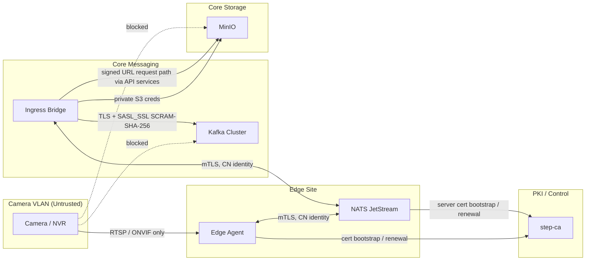

# Security Design — mTLS & ACLs

This document defines the trust model, PKI plan, network isolation rules, and authorization policy for the Cilex Vision platform. It covers the edge-to-core transport boundary, broker authentication, topic and subject ACLs, and object storage access.

**Related documents:**

- [ADR-001: Ingress Bridge](adr/ADR-001-ingress-bridge.md)
- [Kafka Topic Contract](kafka-contract.md)
- [Time Synchronization & Timestamp Policy](time-sync-policy.md)
- [Topic Definitions](../infra/kafka/topics.yaml)
- [step-ca Template](../infra/pki/step-ca-config.json)
- [NATS Config Template](../infra/nats/nats-server.conf)
- [Kafka Broker Template](../infra/kafka/server.properties.template)

## 1. Scope

This policy applies to:

- cameras and NVRs attached to the camera VLAN
- edge agents and site-local NATS JetStream brokers
- the ingress bridge and all Kafka-connected core services
- MinIO object access issued to services and end users
- the internal PKI used to issue certificates to NATS clients and servers

This policy does not define end-user JWT and RBAC behavior in detail. It assumes API-layer auth remains a separate control plane.

## 2. Trust Model

| Component | Trust Level | Authentication Model | Notes |
|----------|-------------|----------------------|-------|
| Cameras / NVRs | Untrusted | None beyond device-local credentials | Treat all camera timestamps and payloads as untrusted input |
| Camera VLAN | Untrusted network | Network isolation only | No direct access to core services, Kafka, MinIO, or the internet |
| Edge Agent -> NATS | Trusted only after mTLS | Mutual TLS with cert subject CN identity | Edge client cert CN identifies the site publisher principal |
| Ingress Bridge -> NATS | Trusted only after mTLS | Mutual TLS with cert subject CN identity | Bridge gets per-site subscribe / DLQ permissions only |
| Core Services -> Kafka | Trusted only after SASL auth | `SASL_SSL` with `SCRAM-SHA-256` | TLS provides transport confidentiality; SCRAM defines the Kafka principal |
| Core Services -> MinIO | Trusted service credentials | Static internal access keys in secret storage | Never exposed to cameras or browsers |
| Browser / API client -> MinIO objects | Time-limited delegated access | Signed URLs | Default GET URL TTL = 1 hour |

### 2.1 Normative Rules

- Cameras are outside the trusted security domain.
- `source_capture_ts` MUST be treated as advisory because camera clocks are untrusted.
- The trusted edge-to-core boundary starts at the edge host identity, not at the camera.
- NATS identity is certificate-based. Kafka identity is SCRAM-principal-based.
- A compromised site MUST be isolatable without rotating credentials for other sites.

## 3. Network Isolation

### 3.1 Zones

| Zone | Contains | Allowed Egress | Forbidden Egress |
|------|----------|----------------|------------------|
| Camera VLAN | Cameras, NVRs | RTSP / ONVIF only to edge agents | Internet, Kafka, MinIO, PostgreSQL, Grafana, Prometheus |
| Edge Control Plane | Edge agent, site-local NATS, local management host | step-ca enrollment, core NATS / bridge path, monitoring | Direct Kafka access, direct PostgreSQL access |
| Core Messaging | Ingress Bridge, Kafka brokers | Kafka, Schema Registry, MinIO, Prometheus | Direct camera VLAN access except via approved bridge paths |
| Core Storage | MinIO, TimescaleDB, PostgreSQL | Internal service traffic only | Camera VLAN and public ingress |
| Operator / Admin | step-ca admin, config management, dashboards | Controlled SSH / HTTPS | Unrestricted lateral access into camera VLAN |

### 3.2 Camera VLAN Rules

- Cameras MUST be placed on a dedicated VLAN or equivalent isolated subnet.
- Cameras MUST NOT have direct internet egress.
- Cameras MUST NOT initiate connections to Kafka, MinIO, PostgreSQL, Redis, Grafana, or Prometheus.
- Edge agents MAY connect to cameras on RTSP and ONVIF ports only.
- Camera-to-camera east-west traffic SHOULD be blocked unless a vendor feature explicitly requires it.

## 4. PKI Plan

### 4.1 CA Topology

The internal PKI uses `step-ca` with one online intermediate CA for issuance and one offline root CA for trust anchoring.

- The offline root signs the online intermediate only.
- `step-ca` is the only online certificate issuer.
- The CA root bundle is distributed to edge nodes, NATS servers, and administrative hosts.

### 4.2 Provisioners

Two provisioners are mandatory:

| Provisioner | Purpose | Rotation Role |
|-------------|---------|---------------|
| `ops-bootstrap` | Administrative bootstrap of new sites and broker certificates | Used by `bootstrap-site.sh` for initial issuance |
| `internal-acme` | Automated renewal of already-enrolled hosts | Used for recurring 90-day renewal without manual reissue |

The reference template is [step-ca-config.json](../infra/pki/step-ca-config.json).

### 4.3 Certificate Types

| Certificate | Subject / CN Pattern | SANs | EKU | Lifetime |
|-------------|----------------------|------|-----|----------|
| Site NATS server | `nats-<site_id>.edge.cilex.internal` | DNS SANs for the site broker hostnames | `serverAuth` | 90 days |
| Edge publisher client | `edge-site-<site_id>` | None | `clientAuth` | 90 days |
| Bridge subscriber client | `bridge-site-<site_id>` | None | `clientAuth` | 90 days |
| Kafka broker | `kafka-<broker_id>.core.cilex.internal` | DNS SANs for broker listeners | `serverAuth` | 90 days |
| Internal service TLS endpoints | service FQDN | DNS SANs | `serverAuth` | 90 days |

### 4.4 Rotation Policy

- All TLS certificates MUST use a 90-day maximum lifetime.
- Automated renewal MUST start no later than day 60 of the current certificate lifetime.
- Revoked certificates MUST be removed from service trust stores within 24 hours.
- Site bootstrap uses the administrative provisioner exactly once; steady-state renewal uses ACME.
- CA passwords and provisioner secrets MUST NOT be committed to the repository.

## 5. NATS Security Model

### 5.1 Transport

NATS uses mutual TLS on every client connection:

- server presents a site-local NATS server certificate signed by the internal CA
- clients present a site-scoped client certificate signed by the same CA
- `verify_and_map` maps the client certificate subject to a configured NATS user

### 5.2 Identity Rule

NATS client identity is derived from the certificate subject CN.

To preserve CN-based identity under `verify_and_map`, NATS client certificates for edge publishers and bridge subscribers MUST be issued without DNS or email SANs. This forces subject-based mapping and keeps authorization tied to the CN-bearing subject string.

### 5.3 Subject Namespace

The approved subject hierarchy is:

- `frames.live.<site_id>.>` for live edge traffic
- `frames.replay.<site_id>.>` for replayed edge traffic
- `frames.dlq.<site_id>.>` for dead-letter messages

JetStream streams and durable consumers MUST be pre-created by Ops per site. Application principals MUST NOT receive broad stream or consumer administration rights.

### 5.4 NATS ACL Matrix

| Principal CN | Publish | Subscribe | Purpose |
|--------------|---------|-----------|---------|
| `edge-site-<site_id>` | `frames.live.<site_id>.>`, `frames.replay.<site_id>.>` | `_INBOX.>` | Publish sampled frames with JetStream PubAck replies only |
| `bridge-site-<site_id>` | `$JS.API.CONSUMER.MSG.NEXT.CILEX_<SITE_ID>.INGRESS_BRIDGE_<SITE_ID>`, `$JS.API.CONSUMER.INFO.CILEX_<SITE_ID>.INGRESS_BRIDGE_<SITE_ID>`, `$JS.ACK.CILEX_<SITE_ID>.INGRESS_BRIDGE_<SITE_ID>.>`, `frames.dlq.<site_id>.>` | `_INBOX.>` | Pull from the site stream and publish DLQ records |
| `ops-admin` | `>` | `>` | Administrative access only |

Rules:

- Site principals MUST NOT use wildcard permissions spanning multiple sites.
- Bridge credentials MUST be one certificate per site, not one shared wildcard bridge certificate.
- Edge publishers MUST NOT have subscribe access to application subjects.

## 6. Kafka Security Model

### 6.1 Transport and Authentication

Kafka brokers expose TLS-encrypted listeners and require `SASL_SSL` with `SCRAM-SHA-256` for client authentication.

- TLS authenticates the broker to the client and encrypts the transport.
- SCRAM authenticates the client and establishes the Kafka principal used by ACL evaluation.
- Kafka clients do **not** use mutual TLS client certificates as their authorization identity.

The broker template is [server.properties.template](../infra/kafka/server.properties.template).

### 6.2 Principal Naming Convention

Kafka principals use the form `User:svc-<service-name>`.

Examples:

- `User:svc-ingress-bridge`
- `User:svc-attribute`
- `User:svc-embedding`
- `User:svc-event-engine`
- `User:svc-bulk-collector`
- `User:svc-mtmc`
- `User:svc-archive`
- `User:svc-debug-trace`
- `User:svc-kafka-broker` for inter-broker auth

### 6.3 ACL Rules

- `allow.everyone.if.no.acl.found` MUST be `false`.
- Topic ACLs MUST be exact-topic grants, not wildcard `*` grants.
- Consumer group ACLs MUST be exact-group grants, not wildcard group grants.
- Only the broker admin principal may hold cluster-wide super-user rights.

### 6.4 Kafka Topic and Group ACL Matrix

The canonical topic list comes from [topics.yaml](../infra/kafka/topics.yaml).

| Principal | Topic Read | Topic Write | Group Read |
|-----------|------------|-------------|------------|
| `User:svc-ingress-bridge` | — | `frames.sampled.refs` | — |
| `User:svc-attribute` | `tracklets.local` | `attributes.jobs` | `cg-attribute` |
| `User:svc-embedding` | `tracklets.local` | `mtmc.active_embeddings` | `cg-embedding` |
| `User:svc-mtmc` | `tracklets.local`, `attributes.jobs`, `mtmc.active_embeddings` | — | `cg-mtmc-tracklets`, `cg-mtmc-attrs`, `cg-mtmc-gallery` |
| `User:svc-event-engine` | `tracklets.local` | `events.raw`, `archive.transcode.requested` | `cg-event-engine` |
| `User:svc-archive` | `events.raw`, `archive.transcode.requested` | `archive.transcode.completed` | `cg-archive-events`, `cg-archive-transcode` |
| `User:svc-bulk-collector` | `frames.sampled.refs`, `tracklets.local`, `attributes.jobs`, `events.raw`, `archive.transcode.completed` | — | `cg-bulk-collector-frames`, `cg-bulk-collector-tracklets`, `cg-bulk-collector-attrs`, `cg-bulk-collector-events`, `cg-bulk-collector-archive` |
| `User:svc-debug-trace` | `frames.sampled.refs` | — | `cg-debug-trace` |

Operational rules:

- Every consuming principal SHOULD also receive `Describe` on the same topics and groups it reads.
- Every producing principal SHOULD also receive `Describe` on the topics it writes.
- Query API and frontend services MUST NOT receive Kafka credentials unless a future design explicitly requires them.

## 7. MinIO Access Model

### 7.1 Internal Service Access

- Internal pipeline services use MinIO access keys stored in secret management.
- Cameras and browsers MUST NEVER receive raw MinIO credentials.
- Buckets remain private; no anonymous bucket listing or object reads.

### 7.2 Signed URLs

- User-facing downloads use signed GET URLs only.
- Default signed URL expiry is 1 hour.
- Signed URLs are issued by the API layer after authorization checks.
- Signed PUT URLs MAY be issued for internal tools only; cameras do not upload directly to MinIO.

## 8. Revocation and Incident Response

- `step-ca` CRL support MUST be enabled.
- Site compromise requires revoking the site edge client certificate, the site bridge client certificate, and the site NATS server certificate if exposed.
- Kafka SCRAM credentials for the affected services MUST be rotated independently of the PKI.
- Site-scoped identities ensure revocation of one site does not force credential replacement across all sites.

## 9. Network Isolation Diagram

## 10. Implementation Assets

This task provides the following reference assets:

- [docs/security-design.md](security-design.md)
- [infra/pki/step-ca-config.json](../infra/pki/step-ca-config.json)
- [infra/pki/bootstrap-site.sh](../infra/pki/bootstrap-site.sh)
- [infra/nats/nats-server.conf](../infra/nats/nats-server.conf)
- [infra/kafka/server.properties.template](../infra/kafka/server.properties.template)

## 11. Acceptance Criteria

### Automated

- `docs/security-design.md` exists and YAML front-matter contains `status: P0-D08`
- `docs/security-design.md` does not contain the placeholder warning text
- `docs/security-design.md` contains the strings `SASL_SSL`, `SCRAM-SHA-256`, `verify_and_map`, `signed GET URLs`, and `camera VLAN`
- `python3 -m json.tool infra/pki/step-ca-config.json >/dev/null` exits with code `0`
- `bash -n infra/pki/bootstrap-site.sh` exits with code `0`
- `infra/nats/nats-server.conf` contains `verify_and_map: true`
- `infra/kafka/server.properties.template` contains `sasl.enabled.mechanisms=SCRAM-SHA-256` and `allow.everyone.if.no.acl.found=false`
- `infra/kafka/server.properties.template` contains every canonical topic name from `infra/kafka/topics.yaml`
- `.agents/handoff/P0-D08.md` exists

### Human Review

- The Mermaid diagram renders at `mermaid.live`
- Kafka client auth is clearly defined as `SASL_SSL` with `SCRAM-SHA-256`, not certificate-CN authorization
- NATS client auth is clearly defined as mTLS with certificate-subject identity and per-site subject ACLs
- The ACL matrix matches the current topic contract in `docs/kafka-contract.md`
