# Taxonomy & Requirements Specification

## 1. Object Classes

Object classes are the detectable entities tracked by the video analytics platform. Each class has a minimum confidence threshold below which detections are discarded before being written to storage or published to Kafka.

| Class | Confidence Threshold | Definition |
|-------|---------------------|------------|
| person | 0.40 | A human being in any posture: standing, walking, running, seated, or crouching. Excludes mannequins and statues. |
| car | 0.40 | A passenger automobile with up to 8 seats, including sedans, SUVs, hatchbacks, and station wagons. |
| truck | 0.40 | A commercial freight or utility vehicle designed primarily for cargo: pickups, box trucks, flatbeds, semi-trailers. |
| bus | 0.40 | A road vehicle designed to carry more than 8 passengers: city buses, coaches, minibuses, school buses. |
| bicycle | 0.40 | A human-powered two-wheeled vehicle, including pedal bikes, e-bikes, and cargo bikes. Excludes motorcycles. |
| motorcycle | 0.40 | A motorized two- or three-wheeled vehicle, including scooters and mopeds. Excludes bicycles. |
| animal | 0.40 | Any non-human living animal with a detectable bounding box: dogs, cats, birds, deer, etc. |

### Notes on Thresholds
- The 0.40 pilot threshold is deliberately low to maximise recall during evaluation. It will be tuned per-class after bakeoff (see `scripts/bakeoff/`).
- Detections below threshold are **not** discarded at source — they are filtered at the ingest service and may be retained in a separate debug stream at the discretion of the operator.

---

## 2. Attributes

Attributes are secondary properties predicted alongside a bounding box. They are only valid when the parent object class is within the specified scope.

### 2.1 Color Enum

The shared color vocabulary applies to both vehicle and person color attributes:

```
red | blue | white | black | silver | green | yellow | brown | orange | unknown
```

`unknown` is the fallback value when the model confidence for all named colors falls below 0.30, or when occlusion makes the attribute unresolvable.

### 2.2 Attribute Table

| Attribute | Applies To | Type | Confidence Threshold | Notes |
|-----------|-----------|------|---------------------|-------|
| vehicle_color | car, truck, bus, motorcycle | enum (color) | 0.30 | Dominant exterior body color. Excludes windows, wheels, trim. |
| person_upper_color | person | enum (color) | 0.30 | Dominant color of the upper garment (shirt, jacket, coat). |
| person_lower_color | person | enum (color) | 0.30 | Dominant color of the lower garment (trousers, skirt, shorts). |

### 2.3 Attribute Rules
- Attributes are only emitted when `detection_confidence ≥ object_class_threshold`.
- A missing attribute field (proto default / null) means the attribute was not computed, not that the value is `unknown`.
- `unknown` is an explicit model output, not a default.

---

## 3. Events

Events are stateful occurrences derived from track histories. Each event instance is associated with exactly one `track_id` and one `camera_id`.

### 3.1 Required Fields (all events)

| Field | Type | Description |
|-------|------|-------------|
| event_id | UUID | Globally unique event identifier (UUID v4) |
| event_type | enum | One of the event types defined below |
| track_id | UUID | The object track that triggered this event |
| camera_id | string | Identifier of the originating camera |
| start_time | timestamp (UTC) | Wall-clock time the event trigger condition was first met |
| end_time | timestamp (UTC) | Wall-clock time the event close condition was met (null if still active) |
| duration_ms | int64 | `end_time − start_time` in milliseconds (null if still active) |
| clip_uri | string (URI) | URI of the associated video clip segment (object store reference). Never contains raw bytes. |
| source_capture_ts | timestamp (UTC) | Frame timestamp at source camera |
| edge_receive_ts | timestamp (UTC) | Timestamp when edge node received the frame |
| core_ingest_ts | timestamp (UTC) | Timestamp when the core ingest service processed the event |

### 3.2 Event Definitions

#### `entered_scene`
| Field | Value |
|-------|-------|
| Trigger condition | A tracked object's bounding box enters the camera's region of interest (ROI) for the first time, or re-enters after a gap of ≥ 60 s. |
| Close condition | Immediately closed on trigger (point-in-time event). `end_time = start_time`, `duration_ms = 0`. |
| Notes | Emitted at most once per continuous track. ROI is defined per-camera in configuration. |

#### `exited_scene`
| Field | Value |
|-------|-------|
| Trigger condition | A tracked object's bounding box leaves the camera ROI and the track is not recovered within 5 s. |
| Close condition | Immediately closed on trigger (point-in-time event). `end_time = start_time`, `duration_ms = 0`. |
| Notes | If the track re-appears within 5 s, no `exited_scene` is emitted (track re-association window). |

#### `stopped`
| Field | Value |
|-------|-------|
| Trigger condition | A tracked object's centroid displacement falls below 5 px/frame (at source resolution) for ≥ 3 consecutive seconds. Applies to: car, truck, bus, motorcycle, bicycle. |
| Close condition | The object's centroid displacement exceeds 10 px/frame for ≥ 1 s, OR the track ends (exited_scene or track loss). |
| Notes | Not applicable to `person` or `animal` (use `loitering` for persons). Minimum duration to emit: 3 s. |

#### `loitering`
| Field | Value |
|-------|-------|
| Trigger condition | A `person` track remains within a configured loitering zone for ≥ 30 s continuously. The 30 s threshold is configurable per zone. |
| Close condition | The person exits the loitering zone boundary, OR the track ends. |
| Notes | Applies only to `person`. Zones are polygons defined in camera configuration. Overlapping zones each emit independent events. |

#### `motion_started`
| Field | Value |
|-------|-------|
| Trigger condition | Frame-level pixel-change metric (background subtraction) exceeds the configured sensitivity threshold in any detection zone after ≥ 500 ms of no motion. |
| Close condition | Immediately closed on trigger (point-in-time event). `end_time = start_time`, `duration_ms = 0`. |
| Notes | Camera-level event, not track-level. `track_id` is null. Emitted before object detection results are available. |

#### `motion_ended`
| Field | Value |
|-------|-------|
| Trigger condition | Frame-level pixel-change metric falls below sensitivity threshold for ≥ 2 s continuously. |
| Close condition | Immediately closed on trigger (point-in-time event). `end_time = start_time`, `duration_ms = 0`. |
| Notes | Camera-level event. `track_id` is null. Paired with the preceding `motion_started` event via `clip_uri`. |

---

## 4. Non-Functional Requirements

| NFR | Target | Measurement Method |
|-----|--------|--------------------|
| End-to-end latency (p95) | < 2 000 ms | Delta: `core_ingest_ts − source_capture_ts`, measured on the events Kafka topic. Prometheus histogram `e2e_latency_ms` at ingest service. |
| Inference throughput | 5 – 10 FPS per camera | Prometheus gauge `inference_fps{camera_id}` exported by the inference service. |
| Pilot camera count | 4 cameras | Deployment configuration; validated by health-check endpoint returning 4 active streams. |
| Raw video retention | 30 days | MinIO lifecycle policy `raw-video-expiry` set to 30 d on the `raw-video` bucket. |
| Event clip retention | 90 days | MinIO lifecycle policy `event-clip-expiry` set to 90 d on the `event-clips` bucket. |
| Metadata retention | 1 year (365 days) | TimescaleDB `drop_chunks` retention policy on all hypertables, interval = `INTERVAL '365 days'`. |
| Query p95 latency | < 500 ms | Prometheus histogram `query_latency_ms` (buckets: 100, 200, 500, 1000, 2000 ms) at query API. Measured at the API gateway. |
| System availability | ≥ 99.5 % per month | Prometheus `up` scrape success rate over 30-day rolling window. Excludes planned maintenance windows (announced ≥ 24 h in advance). |
| Detection false-positive rate | < 5 % at pilot threshold | Manual audit of 500 random detections per class per week during pilot. Tracked in issue tracker. |
| Kafka consumer lag | < 10 000 messages | Prometheus gauge `kafka_consumer_lag{group, topic}`. Alert at > 10 000 for > 60 s. |

---

## 5. Event State Machine

The following state diagram governs the lifecycle of every event instance. Implementations MUST enforce these transitions and reject invalid state changes.

```mermaid
stateDiagram-v2
    [*] --> new : trigger condition met

    new --> active : event record created and published to Kafka
    new --> closed : trigger and close condition simultaneous\n(point-in-time events: entered_scene,\nexited_scene, motion_started, motion_ended)

    active --> stopped : object ceases motion\n(stopped event sub-state)
    active --> exited : track exits scene or is lost
    stopped --> active : object resumes motion
    stopped --> exited : track exits scene or is lost

    exited --> closed : end_time and duration_ms written;\nfinal event record published

    closed --> [*]
```



### State Descriptions

| State | Description |
|-------|-------------|
| `new` | Trigger condition has been detected but the event record has not yet been persisted or published. Duration in this state should be < 100 ms. |
| `active` | The event is ongoing. The object is tracked within the scene. `end_time` and `duration_ms` are null. |
| `stopped` | Sub-state of `active`. The tracked object has become stationary (applies only to vehicle classes). The event record is updated with intermediate metadata. |
| `exited` | The object has left the scene or the track has been lost. The event close condition has been met but the record has not yet been finalized. |
| `closed` | Terminal state. The event record is complete: `end_time`, `duration_ms`, and `clip_uri` are all populated. No further mutations are permitted. |

---

## 6. Acceptance Criteria

### Automated (checked by `review.sh`)
- [x] File `docs/taxonomy.md` exists and is > 100 lines
- [x] YAML front-matter `status:` is set to `P0-D01` (not `STUB`)
- [x] Placeholder warning is absent
- [x] Contains a Markdown table for object classes (§1)
- [x] Contains a Markdown table for NFRs (§4)

### Human Review
- [x] Every object class has an explicit confidence threshold (§1)
- [x] Every event has explicit trigger and close conditions (§3.2)
- [x] NFR targets are specific numbers, not vague descriptors (§4)
- [x] A Dev agent can implement against this specification without asking clarifying questions
- [x] Mermaid state diagram renders correctly (verify at mermaid.live) (§5)
- [x] Three-timestamp fields (`source_capture_ts`, `edge_receive_ts`, `core_ingest_ts`) are present in event required fields (§3.1)
- [x] `clip_uri` is a URI reference — no raw bytes (§3.1)
