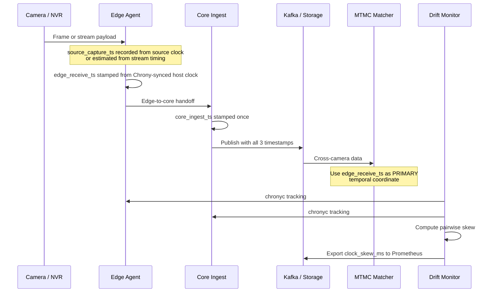

# Time Synchronization & Timestamp Policy

This document defines the authoritative time model for the multi-camera analytics pipeline. It standardizes how timestamps are produced, propagated, monitored, and consumed across edge agents, core ingest, Kafka, storage, and MTMC.

**Related documents:**

- [Taxonomy & Requirements](taxonomy.md)
- [Kafka Topic Contract](kafka-contract.md)
- [Proto README](../proto/README.md)
- [VideoTimestamp Schema](../proto/vidanalytics/v1/common/common.proto)

## 1. Scope

This policy applies to:

- all Linux edge agents that ingest camera or NVR streams
- all core nodes that first receive data from the edge tier
- all services that populate or propagate `vidanalytics.v1.common.VideoTimestamp`
- all monitoring workflows that evaluate inter-camera clock drift

Cameras and NVRs may expose their own clocks, but those clocks are **not** part of the trusted Chrony synchronization domain. They influence `source_capture_ts` only.

## 2. Three-Timestamp Model

Every inter-service message MUST carry the three fields in `VideoTimestamp`:

| Field | Set By | Write Point | Trust Level | Mutation Rule | Primary Use |
|-------|--------|-------------|-------------|---------------|-------------|
| `source_capture_ts` | Edge capture process | When a frame timestamp is decoded from the camera/NVR stream, or estimated from stream timing if the source clock is unavailable | Advisory | Write once at the edge; never rewritten downstream | Source-clock debugging, source-to-core latency analysis when `clock_quality` is reliable |
| `edge_receive_ts` | Edge agent | When the edge pipeline first accepts the frame/message from the camera interface | Authoritative | Write once at the edge; never rewritten downstream | **PRIMARY** time coordinate for cross-camera ordering, MTMC, and temporal joins |
| `core_ingest_ts` | First core ingress service | When the core tier first accepts the message from the edge tier | Authoritative | Written exactly once at the first core boundary; copied unchanged by all downstream producers | Ingest lag, replay analysis, backpressure analysis |

### 2.1 Normative Semantics

- `source_capture_ts` represents the camera-side view of time as observed by the edge capture process.
- `edge_receive_ts` represents the first trusted wall-clock timestamp in the pipeline because it is generated by a Chrony-disciplined edge host.
- `core_ingest_ts` represents the first trusted wall-clock timestamp in the core domain.

### 2.2 Invariants

- All three fields MUST be populated before a message is published to Kafka.
- `edge_receive_ts` and `core_ingest_ts` MUST be UTC timestamps from Chrony-disciplined Linux hosts.
- `core_ingest_ts` MUST be greater than or equal to `edge_receive_ts`.
- `source_capture_ts` MAY be earlier than, equal to, or later than `edge_receive_ts`; consumers MUST NOT assume strict ordering between those two fields.
- Downstream services MUST propagate the original `VideoTimestamp` unchanged. They MUST NOT restamp any of the three fields.

## 3. Timestamp Selection Rules

The platform MUST use different timestamps for different purposes.

| Use Case | Required Timestamp | Rationale |
|----------|--------------------|-----------|
| Cross-camera ordering | `edge_receive_ts` | Edge hosts share the trusted Chrony domain; source clocks do not |
| MTMC matching windows | `edge_receive_ts` | MTMC needs one stable time axis across cameras |
| Temporal joins across camera streams | `edge_receive_ts` | Avoids camera clock drift and vendor-specific timestamp behavior |
| Ingest lag / replay lag | `core_ingest_ts - edge_receive_ts` | Measures transport and core-side backlog only |
| Source-to-core latency analysis | `core_ingest_ts - source_capture_ts` | Useful when `clock_quality` is `PTP_SYNCED` or `NTP_SYNCED`; otherwise debug-only |
| Camera clock diagnostics | `source_capture_ts` plus `clock_quality` | Surfaces whether the source clock can be trusted |

### 3.1 MTMC Rule

MTMC MUST use `edge_receive_ts` as its primary temporal coordinate.

MTMC MUST NOT use `source_capture_ts` to open, close, or rank cross-camera matching windows unless a future ADR explicitly upgrades source-clock trust requirements. `source_capture_ts` remains optional context only.

## 4. Chrony Policy

### 4.1 Node Requirements

Every edge node and every core node MUST:

- run `chronyd`
- be configured with at least 3 upstream NTP sources
- use `makestep 1 3`
- use `rtcsync`
- operate in UTC

The provided templates are:

- [infra/chrony/chrony-edge.conf](../infra/chrony/chrony-edge.conf)
- [infra/chrony/chrony-core.conf](../infra/chrony/chrony-core.conf)

### 4.2 Monitoring Access

The monitoring tier needs read-only access to `chronyc tracking` data on monitored nodes.

- Remote Chrony command access MUST be restricted to the internal monitoring network only.
- The Chrony command port MUST NOT be opened to public networks.
- If remote `chronyc` access is disabled in a hardened environment, an equivalent local textfile-exporter job MAY be used, but it MUST emit the same `clock_skew_ms` metric contract.

### 4.3 Degraded Time State

A node is in a degraded time state when any of the following holds:

- `chronyc tracking` cannot be queried
- `Leap status` is not `Normal`
- fewer than 3 NTP sources are configured on the node

This policy does not define automatic traffic shedding. It does require monitoring to surface the condition so operators can intervene before cross-camera correlation degrades.

## 5. Drift Thresholds

The platform defines two operational thresholds for pairwise inter-camera skew:

| Severity | Threshold | Intended Action |
|----------|-----------|-----------------|
| `WARN` | `clock_skew_ms > 500` | Investigate NTP reachability, source quality, and host load |
| `CRITICAL` | `clock_skew_ms > 2000` | Treat cross-camera correlation as unreliable until corrected |

These thresholds apply to the estimated skew between camera time domains, not to the advisory source clock alone.

## 6. Drift Measurement Contract

The monitoring job at [services/monitoring/clock_drift_check.py](../services/monitoring/clock_drift_check.py) computes pairwise skew from `chronyc tracking` responses.

### 6.1 Input Contract

The script consumes a JSON target file with one object per camera:

```json
[
  {
    "camera_id": "cam-001",
    "chrony_host": "edge-01.internal",
    "site_id": "site-a"
  },
  {
    "camera_id": "cam-002",
    "chrony_host": "edge-02.internal",
    "site_id": "site-a"
  }
]
```

Field rules:

- `camera_id`: required, globally unique camera identifier
- `chrony_host`: required, host that answers `chronyc tracking` for that camera's time domain
- `site_id`: optional grouping key; when present, pairwise skew is computed only within the same site

### 6.2 Computation Rule

For each unique `chrony_host`, the collector queries:

```bash
chronyc -n -h <chrony_host> -c tracking
```

The collector extracts the `system_time` offset from the CSV output and computes:

```text
clock_skew_ms(camera_a, camera_b) =
  abs(system_time_offset_seconds(host_a) - system_time_offset_seconds(host_b)) * 1000
```

Rules:

- If two cameras share the same `chrony_host`, they share the same host offset for skew calculation.
- Pairs are emitted in lexical order of `camera_id` so each camera pair appears exactly once.
- The metric is an estimated pairwise skew derived from Chrony-tracked host offsets.

### 6.3 Prometheus Contract

The collector MUST emit Prometheus exposition text containing:

```text
# HELP clock_skew_ms Estimated pairwise clock skew between camera time domains.
# TYPE clock_skew_ms gauge
clock_skew_ms{camera_a="cam-001",camera_b="cam-002"} 42.500000
```

The alert rules are defined in [infra/prometheus/rules/clock-drift.yml](../infra/prometheus/rules/clock-drift.yml).

## 7. Reference Flow



## 8. Implementation Notes

- `source_capture_ts` remains mandatory even when the source clock is weak; `clock_quality` communicates how reliable that timestamp is.
- `edge_receive_ts` is the platform's default timestamp for any logic that spans multiple cameras.
- `core_ingest_ts` exists to separate edge-side timing from transport and core backlog.
- This policy intentionally separates source-clock diagnostics from authoritative pipeline time.

## 9. Acceptance Criteria

### Automated

- `docs/time-sync-policy.md` exists and YAML front-matter contains `status: P0-D07`
- `docs/time-sync-policy.md` does not contain the placeholder warning text
- `docs/time-sync-policy.md` contains the strings `source_capture_ts`, `edge_receive_ts`, `core_ingest_ts`, and `MTMC MUST use \`edge_receive_ts\``
- `infra/chrony/chrony-edge.conf` exists and contains at least 3 `pool` directives plus `makestep 1 3` and `rtcsync`
- `infra/chrony/chrony-core.conf` exists and contains at least 3 `pool` directives plus `makestep 1 3` and `rtcsync`
- `python3 -m py_compile services/monitoring/clock_drift_check.py` exits with code `0`
- `python3 services/monitoring/clock_drift_check.py --help` exits with code `0`
- `infra/prometheus/rules/clock-drift.yml` contains alert rules named `ClockSkewWarn` and `ClockSkewCritical`
- `infra/prometheus/rules/clock-drift.yml` contains the threshold expressions `> 500` and `> 2000`

### Human Review

- The Mermaid diagram renders at `mermaid.live`
- The drift formula in §6.2 matches the collector implementation
- The MTMC timestamp rule in §3.1 matches downstream service behavior
