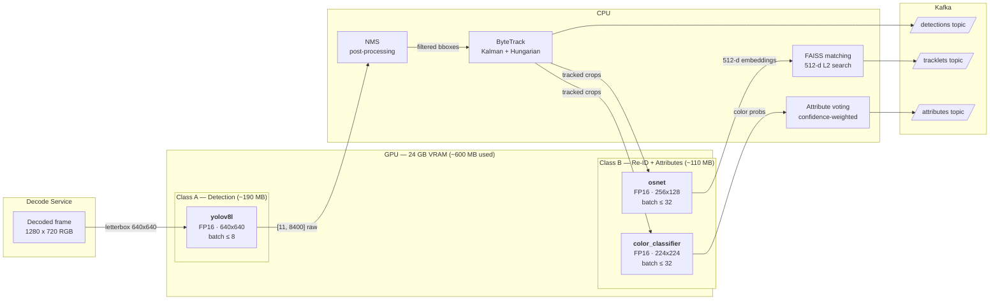

# Triton Model Placement & VRAM Budget

## 1. Overview

The Cilex Vision inference pipeline runs **3 models** on a single NVIDIA GPU (24 GB)
via NVIDIA Triton Inference Server. All models use **FP16 compute precision**
(TensorRT) with FP32 I/O for client compatibility. Total peak VRAM usage is
**~600 MB (~2.4%)**, leaving substantial headroom for shadow deployment,
instance scaling, and future model additions.

Key design choices:

| Decision | Rationale |
|----------|-----------|
| EXPLICIT model control | Shadow deployment without accidental swaps (ADR-005) |
| FP16 TensorRT engines | 2x throughput, ~50% VRAM vs FP32, negligible mAP loss |
| Dynamic batching | Amortize GPU launch overhead; adapt to variable load |
| Single GPU co-location | Avoids cross-GPU data copies; all models fit within 3% of 24 GB |
| 3 models, not 4 | Color classifier serves all 3 color attributes (vehicle, upper, lower) via different crops; separate clothing classifier unnecessary per taxonomy (P0-D01) |

### References

- ADR-005: Triton EXPLICIT Mode (PROJECT-STATUS.md)
- ADR-008: Model Version Boundary (PROJECT-STATUS.md)
- docs/taxonomy.md: 7 object classes, 10 color values, 3 color attributes
- infra/triton/models/: Triton config.pbtxt files for each model

---

## 2. Model Inventory

| # | Model | Role | Architecture | Params | Precision | Input Shape | Output Shape | Max Batch | Instances |
|---|-------|------|-------------|--------|-----------|-------------|--------------|-----------|-----------|
| 1 | yolov8l | Object detector (7 classes) | YOLOv8-Large | 43.7 M | FP16 | 3 x 640 x 640 | 11 x 8400 | 8 | 1 |
| 2 | osnet | Re-ID embeddings (512-d) | OSNet-x1.0 | 2.2 M | FP16 | 3 x 256 x 128 | 512 | 32 | 1 |
| 3 | color_classifier | Color attribute (10 classes) | ResNet-18 | 11.7 M | FP16 | 3 x 224 x 224 | 10 | 32 | 1 |

### Notes

- **yolov8l** detects the 7 taxonomy classes: person, car, truck, bus, bicycle, motorcycle, animal.
  Output tensor `output0` is `[batch, 4 + 7, 8400]` — 4 bbox coordinates (cx, cy, w, h) plus
  7 class scores across 8400 anchor points (80x80 + 40x40 + 20x20 grids at 640x640 input).
  NMS is performed post-Triton on the inference client (CPU).

- **osnet** produces L2-normalized 512-dimensional embeddings for cross-camera Re-ID.
  Per ADR-008, embeddings from different model versions MUST NOT be compared — FAISS index
  is flushed and trackers are reset on OSNet version cutover.

- **color_classifier** outputs probabilities over the 10-color vocabulary from
  docs/taxonomy.md: red, blue, white, black, silver, green, yellow, brown, orange, unknown.
  The attribute service crops different regions and sends them as separate inference requests:
  - Vehicle body crop -> `vehicle_color`
  - Person upper-body crop (top ~50% of bbox) -> `person_upper_color`
  - Person lower-body crop (bottom ~50% of bbox) -> `person_lower_color`

- **ByteTrack** (single-camera tracker) is CPU-only (Kalman filter + Hungarian algorithm).
  It is NOT a Triton model — it runs in the tracking service process.

### Why 3 models, not 4

The original draft inventory included a separate "clothing classifier" (ResNet-18). After the
taxonomy was finalized (P0-D01), all 3 color attributes use the **same 10-color vocabulary**.
A single `color_classifier` model serves all three by receiving appropriately cropped inputs
from the attribute service. If future attributes require a different output space (e.g., clothing
type), a 4th model can be added within the existing VRAM budget.

---

## 3. GPU Classes & Co-Location Rules

### GPU Class A — Detection

| Property | Value |
|----------|-------|
| Models | yolov8l |
| Function | Object detection, bounding box + class prediction |
| Peak VRAM | ~190 MB |
| Downstream (CPU) | NMS post-processing, ByteTrack |

### GPU Class B — Re-ID & Attributes

| Property | Value |
|----------|-------|
| Models | osnet, color_classifier |
| Function | Re-ID embedding extraction, color attribute classification |
| Peak VRAM | ~110 MB |
| Downstream (CPU) | Confidence-weighted voting, FAISS matching |

### Co-Location Rules

1. **All 3 models MUST reside on the same GPU.** The pipeline processes a single
   frame through detection -> tracking -> Re-ID + attributes sequentially.
   Splitting models across GPUs would add PCIe transfer latency with no VRAM benefit
   (total usage is ~2.4% of 24 GB).

2. **Class A runs first, Class B runs after.** Detection produces bounding boxes
   that are cropped from the original frame and sent to Class B models.
   Class B models never run without prior Class A output.

3. **Class B models MAY execute in parallel.** OSNet and color_classifier process
   the same crops independently. Triton's scheduler handles concurrent execution
   on the same GPU.

4. **Shadow deployment of any model is permitted.** Even with 2 versions of the
   largest model (yolov8l) loaded simultaneously, total VRAM stays under 4%
   of 24 GB (see section 9).

5. **Instance count increases are independent per model.** If detection becomes
   the throughput bottleneck, add yolov8l instances without touching Class B models.

---

## 4. VRAM Budget

### Per-Model Breakdown

| Component | yolov8l | osnet | color_classifier |
|-----------|---------|-------|-----------------|
| TensorRT engine (weights) | 90 MB | 10 MB | 25 MB |
| Activation memory | 60 MB | 20 MB | 20 MB |
| I/O buffers (max batch) | 35 MB | 13 MB | 20 MB |
| **Peak per model** | **185 MB** | **43 MB** | **65 MB** |

### System Budget (24 GB GPU)

| Item | VRAM | % of 24 GB |
|------|------|------------|
| CUDA context + Triton server | 300 MB | 1.2% |
| yolov8l (1 instance, batch=8) | 185 MB | 0.8% |
| osnet (1 instance, batch=32) | 43 MB | 0.2% |
| color_classifier (1 instance, batch=32) | 65 MB | 0.3% |
| **Total peak** | **~600 MB** | **~2.4%** |
| **Free headroom** | **~23.4 GB** | **~97.6%** |

### I/O Buffer Calculation

Buffers are sized for max batch with FP32 I/O:

| Model | Input | Output |
|-------|-------|--------|
| yolov8l | 8 x 3 x 640 x 640 x 4B = 31.5 MB | 8 x 11 x 8400 x 4B = 3.0 MB |
| osnet | 32 x 3 x 256 x 128 x 4B = 12.6 MB | 32 x 512 x 4B = 0.1 MB |
| color_classifier | 32 x 3 x 224 x 224 x 4B = 19.3 MB | 32 x 10 x 4B < 0.1 MB |

### Headroom Utilization Plan

The ~23.4 GB of free headroom accommodates:

| Scenario | Additional VRAM | Total | % of 24 GB |
|----------|----------------|-------|------------|
| Shadow deployment (2x yolov8l) | +185 MB | ~785 MB | 3.2% |
| 4x detector instances (32 cameras) | +555 MB | ~1.15 GB | 4.7% |
| Future pose estimation model (~200 MB) | +200 MB | ~800 MB | 3.3% |
| All of the above combined | +940 MB | ~1.54 GB | 6.3% |

---

## 5. Dynamic Batching

### Per-Model Configuration

| Model | Preferred Batch | Max Batch | Max Queue Delay | Rationale |
|-------|----------------|-----------|-----------------|-----------|
| yolov8l | 1, 4, 8 | 8 | 50 ms | Latency-critical: gates entire pipeline, directly affects e2e latency NFR (<2s) |
| osnet | 8, 16, 32 | 32 | 100 ms | Batch-efficient: many crops per frame, throughput > latency |
| color_classifier | 8, 16, 32 | 32 | 100 ms | Same as osnet — processes same crop set |

### Batching Behavior

- **yolov8l:** At low load (1-4 cameras), most inferences run at batch=1 with no
  queue delay. As camera count increases, the batcher aggregates frames from
  multiple cameras into batches of 4-8, improving GPU utilization.

- **osnet / color_classifier:** At 4 cameras x 10 FPS x ~5 detections/frame = ~200 crops/s.
  With batch=32 and 100 ms max queue delay, the batcher typically fills batches of
  16-32, yielding 6-12 batch executions per second — well within GPU capacity.

---

## 6. Preprocessing Requirements

All preprocessing is the **inference client's responsibility** — Triton receives
ready-to-infer tensors. The table below documents the expected input format for
each model so the dev agent implementing the inference client can preprocess correctly.

| Model | Color Space | Value Range | Normalization | Resize Method |
|-------|------------|-------------|---------------|---------------|
| yolov8l | RGB | [0.0, 1.0] | Divide by 255 | Letterbox to 640x640, pad with gray (114/255) |
| osnet | RGB | [0.0, 1.0] | ImageNet: mean=[0.485, 0.456, 0.406], std=[0.229, 0.224, 0.225] | Bilinear resize to 256x128 |
| color_classifier | RGB | [0.0, 1.0] | ImageNet: mean=[0.485, 0.456, 0.406], std=[0.229, 0.224, 0.225] | Bilinear resize to 224x224 |

### Tensor Layout

All inputs are NCHW format: `[batch, channels, height, width]`.

The batch dimension is handled by Triton's dynamic batcher — clients send individual
requests (no batch dim) and Triton aggregates them. The max_batch_size in config.pbtxt
defines the upper bound.

---

## 7. Triton Server Configuration

### Server Launch Flags

```bash
tritonserver \
  --model-repository=/models \
  --model-control-mode=explicit \
  --strict-model-config=true \
  --grpc-port=8001 \
  --http-port=8000 \
  --metrics-port=8002 \
  --log-verbose=0 \
  --exit-on-error=true
```

| Flag | Value | Rationale |
|------|-------|-----------|
| `--model-control-mode=explicit` | EXPLICIT | ADR-005: no auto-load, manual load/unload for shadow deployment |
| `--strict-model-config=true` | true | Require config.pbtxt — no auto-generated configs |
| `--metrics-port=8002` | 8002 | Prometheus scrape target, separate from gRPC/HTTP |
| `--exit-on-error=true` | true | Fail fast on startup errors (CONVENTIONS.md) |

### Model Repository Layout

```
infra/triton/models/
├── yolov8l/
│   ├── config.pbtxt
│   └── 1/
│       └── model.plan          # TensorRT engine (built by trtexec)
├── osnet/
│   ├── config.pbtxt
│   └── 1/
│       └── model.plan
└── color_classifier/
    ├── config.pbtxt
    └── 1/
        └── model.plan
```

Version directories (`1/`, `2/`, ...) contain TensorRT engine files. The `version_policy`
in each config.pbtxt is set to `latest { num_versions: 2 }` to support shadow deployment
(two versions loaded simultaneously during cutover).

---

## 8. Model Lifecycle & Shadow Deployment

### EXPLICIT Mode Operations (ADR-005)

On server start, **no models are loaded**. The inference service explicitly loads
required models via the Triton model management API:

```
POST /v2/repository/models/{model_name}/load
POST /v2/repository/models/{model_name}/unload
GET  /v2/repository/models/{model_name}/ready
```

### Shadow Deployment Procedure

Per ADR-005, model updates follow a shadow deployment lifecycle:

1. **Upload** — Place new TensorRT engine in version directory `N+1/model.plan`
2. **Load** — `POST /v2/repository/models/{model}/load` loads both version N and N+1
   (version_policy: latest 2)
3. **Shadow** — Route a copy of production traffic to version N+1; compare outputs
   for 24-48 hours (accuracy, latency, error rate)
4. **Cutover** — Switch production traffic to version N+1
5. **Monitor** — Watch metrics for 24 hours post-cutover
6. **Unload** — Remove version N: `POST /v2/repository/models/{model}/unload`
   with version parameter, then delete the old engine file
7. **Rollback** — If metrics degrade during steps 4-5, switch traffic back to
   version N and unload N+1

### OSNet Version Boundary (ADR-008)

OSNet cutover requires additional steps because embeddings are incompatible
across model versions:

1. Complete shadow deployment steps 1-3 above
2. **Flush FAISS index** — clear all active embeddings
3. **Reset trackers** — force ByteTrack re-initialization across all cameras
4. **Cutover** — switch production to new version
5. Expected ~30 second matching blackout during flush/reset

### TensorRT Engine Build Commands

Build engines from ONNX exports using `trtexec`. Dynamic shapes are required
for Triton's dynamic batching. The `--workspace` flag sets the maximum temporary
memory (MB) available to TensorRT during engine optimization.

**yolov8l** (7-class detector):
```bash
trtexec \
  --onnx=yolov8l_7cls.onnx \
  --saveEngine=model.plan \
  --fp16 \
  --minShapes=images:1x3x640x640 \
  --optShapes=images:4x3x640x640 \
  --maxShapes=images:8x3x640x640 \
  --workspace=1024
```

**osnet** (Re-ID):
```bash
trtexec \
  --onnx=osnet_x1_0.onnx \
  --saveEngine=model.plan \
  --fp16 \
  --minShapes=images:1x3x256x128 \
  --optShapes=images:16x3x256x128 \
  --maxShapes=images:32x3x256x128 \
  --workspace=512
```

**color_classifier** (10-color):
```bash
trtexec \
  --onnx=resnet18_color_10cls.onnx \
  --saveEngine=model.plan \
  --fp16 \
  --minShapes=images:1x3x224x224 \
  --optShapes=images:16x3x224x224 \
  --maxShapes=images:32x3x224x224 \
  --workspace=512
```

---

## 9. Shadow Deployment VRAM Impact

During shadow deployment, two versions of a model are loaded simultaneously.
The worst case is shadowing the largest model (yolov8l):

| Scenario | VRAM |
|----------|------|
| Normal operation (3 models, 1 version each) | ~600 MB |
| + Shadow yolov8l v2 | +185 MB = ~785 MB |
| + Shadow osnet v2 | +43 MB = ~643 MB |
| + Shadow color_classifier v2 | +65 MB = ~665 MB |
| Worst case (shadow all 3 simultaneously) | +293 MB = ~893 MB |

**Worst-case shadow VRAM: ~893 MB (3.6% of 24 GB).** Shadow deployment is
always safe from a VRAM perspective.

---

## 10. Scaling Recommendations

### Throughput Estimates (single instance, 24 GB GPU)

| Model | Batch | Est. Throughput | Note |
|-------|-------|----------------|------|
| yolov8l FP16 | 8 | 200-350 FPS | Varies by GPU model (A5000: ~200, RTX 4090: ~350) |
| osnet FP16 | 32 | 1000-2000 FPS | Small model, very fast |
| color_classifier FP16 | 32 | 2000-4000 FPS | ResNet-18 is lightweight |

### Camera-to-Instance Mapping

| Cameras | FPS (total) | Crops/s (est.) | Detector Instances | Re-ID/Color Instances | Est. VRAM |
|---------|------------|---------------|--------------------|-----------------------|-----------|
| 4 (pilot) | 40 | ~200 | 1 | 1 | ~600 MB |
| 16 | 160 | ~800 | 1 | 1 | ~600 MB |
| 32 | 320 | ~1600 | 2 | 1 | ~785 MB |
| 64 | 640 | ~3200 | 4 | 2 | ~1.15 GB |

Assumptions: 10 FPS per camera, ~5 detections per frame on average, 1 Re-ID + 1.5 color
inferences per detection (persons have 2 color crops, vehicles have 1).

### Scaling Strategy

- **Vertical first:** Increase `instance_group.count` in config.pbtxt. Each additional
  instance of yolov8l adds ~185 MB; osnet adds ~43 MB; color_classifier adds ~65 MB.
- **Horizontal second:** At 64+ cameras, consider a second GPU with the full model set
  replicated. Do NOT split models across GPUs — keep the full pipeline on one GPU
  to avoid cross-GPU latency.
- **Monitor `nv_gpu_utilization`:** Scale instances when sustained utilization exceeds 80%.

---

## 11. Monitoring & Alerts

### Triton Native Metrics

Triton exposes Prometheus metrics on port 8002. Key metrics for operational monitoring:

| Metric | Type | Labels | Purpose |
|--------|------|--------|---------|
| `nv_gpu_memory_used_bytes` | Gauge | gpu_uuid | Current VRAM usage |
| `nv_gpu_memory_total_bytes` | Gauge | gpu_uuid | Total VRAM capacity |
| `nv_gpu_utilization` | Gauge | gpu_uuid | GPU compute utilization (0-1) |
| `nv_inference_request_success` | Counter | model, version | Successful inference count |
| `nv_inference_request_failure` | Counter | model, version | Failed inference count |
| `nv_inference_queue_duration_us` | Summary | model, version | Time in batcher queue (microseconds) |
| `nv_inference_compute_infer_duration_us` | Summary | model, version | GPU compute time (microseconds) |
| `nv_inference_request_duration_us` | Summary | model, version | Total request time (microseconds) |
| `nv_inference_count` | Counter | model, version | Total inference count |

### Alert Rules

See `infra/prometheus/rules/triton-alerts.yml` for the full alert configuration.

| Alert | Threshold | Duration | Severity |
|-------|-----------|----------|----------|
| TritonVramWarn | VRAM > 85% | 5 min | warning |
| TritonVramCritical | VRAM > 95% | 2 min | critical |
| TritonQueueDelayWarn | Avg queue > 100 ms | 5 min | warning |
| TritonQueueDelayCritical | Avg queue > 500 ms | 2 min | critical |
| TritonInferenceErrorRate | Error rate > 1% | 5 min | warning |
| TritonModelNotReady | Model not serving | 1 min | critical |

### Grafana Dashboard Queries (reference)

```promql
# VRAM utilization percentage
(nv_gpu_memory_used_bytes / nv_gpu_memory_total_bytes) * 100

# Per-model average inference latency (ms)
rate(nv_inference_compute_infer_duration_us_sum[5m])
  / rate(nv_inference_compute_infer_duration_us_count[5m]) / 1000

# Per-model throughput (inferences/sec)
rate(nv_inference_count[1m])

# Average queue delay (ms)
rate(nv_inference_queue_duration_us_sum[5m])
  / rate(nv_inference_queue_duration_us_count[5m]) / 1000
```

---

## 12. Inference Pipeline Diagram



---

## 13. Acceptance Criteria

### Automated

- [ ] File `docs/triton-placement.md` exists and is > 100 lines
- [ ] YAML front-matter `status:` is set to `P0-D10` (not `STUB`)
- [ ] Placeholder warning (`This is a placeholder`) is absent
- [ ] `infra/triton/models/yolov8l/config.pbtxt` exists and contains `platform: "tensorrt_plan"`
- [ ] `infra/triton/models/osnet/config.pbtxt` exists and contains `platform: "tensorrt_plan"`
- [ ] `infra/triton/models/color_classifier/config.pbtxt` exists and contains `platform: "tensorrt_plan"`
- [ ] `infra/prometheus/rules/triton-alerts.yml` is valid YAML with `groups:` key
- [ ] All three config.pbtxt files contain `dynamic_batching` section
- [ ] All three config.pbtxt files contain `instance_group` section

### Human Review

- [ ] Model inventory matches the 7-class taxonomy from docs/taxonomy.md
- [ ] VRAM budget totals are internally consistent (per-model sums = total)
- [ ] Co-location rules are clear and non-contradictory
- [ ] Dynamic batching parameters are justified (latency-critical vs throughput-optimized)
- [ ] Shadow deployment VRAM math is correct
- [ ] Scaling recommendations are realistic for the pilot (4 cameras)
- [ ] Mermaid diagram renders correctly (verify at mermaid.live)
- [ ] Preprocessing requirements match standard model expectations (ImageNet normalization for osnet/color)
- [ ] Alert thresholds (85%/95% VRAM, 100ms/500ms queue) are reasonable for real-time video analytics
