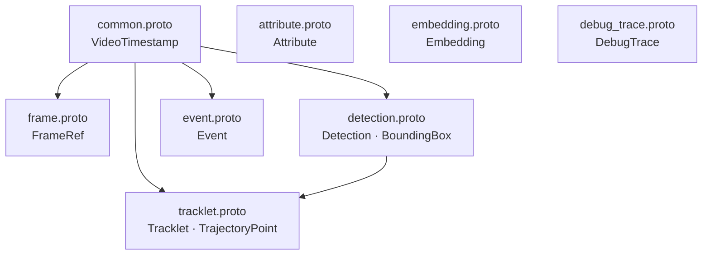

# Proto Schema Package — `vidanalytics.v1`

This directory contains all Protobuf schemas for the Multi-Camera Video Analytics Platform.
All inter-service messages on Kafka and NATS MUST use these schemas.

---

## Package Layout

Files are organized under `proto/vidanalytics/v1/<domain>/` to match package names (required by `buf lint`).

| File | Package | Key Messages |
|------|---------|--------------|
| `vidanalytics/v1/common/common.proto` | `vidanalytics.v1.common` | `VideoTimestamp`, `ClockQuality` |
| `vidanalytics/v1/frame/frame.proto` | `vidanalytics.v1.frame` | `FrameRef` |
| `vidanalytics/v1/detection/detection.proto` | `vidanalytics.v1.detection` | `Detection`, `BoundingBox`, `ObjectClass` |
| `vidanalytics/v1/tracklet/tracklet.proto` | `vidanalytics.v1.tracklet` | `Tracklet`, `TrajectoryPoint`, `TrackletState` |
| `vidanalytics/v1/attribute/attribute.proto` | `vidanalytics.v1.attribute` | `Attribute`, `Color`, `AttributeType` |
| `vidanalytics/v1/embedding/embedding.proto` | `vidanalytics.v1.embedding` | `Embedding`, `EmbeddingSourceType` |
| `vidanalytics/v1/event/event.proto` | `vidanalytics.v1.event` | `Event`, `EventType`, `EventState` |
| `vidanalytics/v1/debug/debug_trace.proto` | `vidanalytics.v1.debug` | `DebugTrace`, `PipelineStage` |

### Message Dependency Diagram



---

## Three-Timestamp Rule

Every Kafka message MUST carry a `VideoTimestamp` with all three fields populated:

| Field | Set By | Semantics |
|-------|--------|-----------|
| `source_capture_ts` | Edge capture process | When the camera sensor captured the frame. Never rewritten downstream. |
| `edge_receive_ts` | Edge pipeline | When the edge node ingested the frame from the camera interface. |
| `core_ingest_ts` | Core ingest service | When the core processing pipeline first handled this message. |

`ClockQuality` documents the reliability of `source_capture_ts` so consumers can make informed decisions about timestamp-based ordering and latency calculations.

---

## Backward Compatibility Policy

**All schema changes MUST be backward-compatible.** This is enforced by `buf breaking` in CI on every pull request (see `.github/workflows/proto-check.yml`).

### Permitted Changes

| Change | Notes |
|--------|-------|
| Add a new field with a new field number | Default value semantics must be acceptable for old consumers. |
| Add a new enum value | Consumers must handle unknown enum values gracefully. |
| Add a new message type | Safe — no effect on existing messages. |
| Add a new `.proto` file | Safe — no effect on existing schemas. |

### Forbidden Changes

| Change | Reason |
|--------|--------|
| Remove or rename a field | Breaks deserialization for consumers on old schema. |
| Change a field's type | Wire format incompatibility. |
| Reuse a previously deleted field number | Corrupt data for consumers with cached schemas. |
| Change a field number | Breaks all existing serialised data. |
| Remove or rename an enum value | Breaks consumers that pattern-match on enum names. |
| Change from `proto3` to `proto2` (or reverse) | Incompatible wire semantics. |

### Field Number Reservation

When a field is removed it MUST be added to a `reserved` statement in the same message. This prevents accidental reuse of the field number:

```protobuf
message Example {
  reserved 3, 7;           // deleted fields — never reuse these numbers
  reserved "old_name";     // deleted field names — never reuse these names

  string active_field = 1;
  int32  other_field  = 2;
}
```

### Version Cadence

Breaking changes require a new major version (`v2`). Creating a `v2` package is a heavyweight operation that requires:
1. An ADR approved by the architecture review (see `docs/adr/`).
2. A migration guide for all consumers.
3. A deprecation period of at least 90 days for `v1`.

---

## Naming Conventions

| Entity | Convention | Example |
|--------|-----------|---------|
| Field names | `snake_case` | `camera_id`, `source_capture_ts` |
| Enum values | `UPPER_SNAKE_CASE` with type prefix | `OBJECT_CLASS_PERSON`, `COLOR_RED` |
| Enum zero value | `<TYPE>_UNSPECIFIED` | `OBJECT_CLASS_UNSPECIFIED` |
| Message names | `PascalCase` | `BoundingBox`, `VideoTimestamp` |
| Package names | `vidanalytics.v1.<domain>` | `vidanalytics.v1.detection` |

---

## Validation

Run lint and breaking-change checks locally before pushing:

```bash
# From the repo root
buf lint proto/
buf breaking proto/ --against '.git#branch=main'
```

Both commands must exit with code 0 for CI to pass.

---

## Acceptance Criteria

- [ ] `buf lint proto/` exits 0
- [ ] `buf breaking proto/ --against '.git#branch=main'` exits 0 (on non-main branches)
- [ ] All `.proto` files use `syntax = "proto3"`
- [ ] All enum zero values end in `_UNSPECIFIED`
- [ ] All field names are `snake_case`
- [ ] All enum values are `UPPER_SNAKE_CASE`
- [ ] Every Kafka-published message imports and embeds `VideoTimestamp`
- [ ] No raw image or video bytes are present in any message
